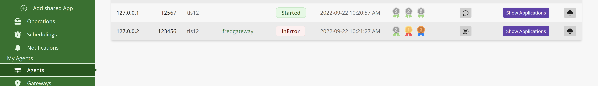

# Agents/Gateways configuration best practices

According to your configuration, differents badges will be displayed in the UI. The badges are indicators which are used to secure your I.S (Information System).

The badges are displayed in the **Agents** view.

### Protocol badges

* The first badge encourages the use of a recent version of the Tls protocol:
  
| Protocol | Badge |
|----------|--------|
| Tls13|   |
|Tls12|  |
|Tls - Ssl | |

### Gateway badges

* The second badge encourages the use of a gateway to access agents. Indeed, the gateways are there to guarantee a stronger isolation at the network level and at the application level.

| Number of gateways by agent | Badge |
|----------|--------|
| At least one |    |
| None|     |

### Resilience badges
* The third badge encourages the use of several sites (at least primary and secondary). This declaration of the different sites is configured using the "trustedservers" variable in the agent's config.dat file. If "ignoretrustedservers" a "gold medal" will be displayed.

| Number of servers declared in "trustedserver" | Badge |
|----------|--------|
| At least two |  |
| One |  |
| None|   |

