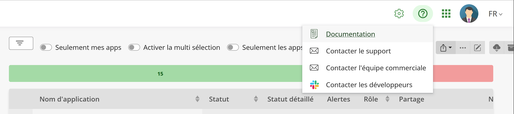

# Exécuter AppControl Localement avec Docker Compose

Ce package vous permet d'installer et exécuter l'application X4B AppControl
d'Invivoo localement sur votre PC Windows. Pour installer X4B AppControl en
mode local sous Windows, dé-zippez
ce
[fichier](https://github.com/xcomponent/appcontrol-documentation/releases/latest/download/appcontrol-standalone.zip) dans
un répertoire d'installation, et placez-vous dans ce répertoire pour la suite
des instructions.

## Qu'est-ce qu'AppControl ?

La plateforme [X4B](https://x4b.xcomponent.com/) d'Invivoo permet aux
organisations d'intégrer tous leurs processus métier, leurs activités, et leurs
systèmes dans un modèle global, data-driven, qui offre la collaboration,
l'accès à une information pertinente selon le profil de chacun, et la
possibilité d'une action immédiate à partir des dashboards.

**AppControl** est un élément central de la plateforme X4B. Il supporte le
pilotage et le monitoring intelligents de vos applications et systèmes à
travers un écran de visualisation où les dépendances entre les différents
composants d'une application sont représentées par un graphe, et utilisées pour
garantir que les arrêts/relances se font dans le bon ordre.

AppControl est fourni avec un jeu de commandes standard pour le pilotage des
applications, et vous pouvez ajouter vos propres commandes personnalisées pour
la récupération d'informations ou métriques, ou le déclenchement d'actions
spécifiques.

## Licence et Conditions d'Utilisation d'AppControl

L'utilisation d'AppControl est libre et gratuite à des fins de formation
individuelle. Pour tout usage en production, merci de
contacter [Invivoo](mailto:sales@xcomponent.com).

## Installation Locale d'AppControl

L'application AppControl est fournie sous forme d'images Docker, prévues pour
être exécutées dans un orchestrateur de conteneurs tel
que [Kubernetes](https://kubernetes.io/)
ou
[OpenShift](https://www.redhat.com/en/technologies/cloud-computing/openshift)
de Red Hat. Invivoo fournit des charts [Helm](https://helm.sh/) pour ce mode de
déploiement, qui est celui recommandé pour tout environnement de production.

Pour ceux qui découvrent AppControl pour la première fois, et à des fins de
formation individuelle, Invivoo fournit ce package qui permet le déploiement en
local via [Docker Compose](https://docs.docker.com/compose/), de façon à vous
permettre de démarrer sur votre PC portable et explorer rapidement les
possibilités du logiciel. 

AppControl inclut une gateway et des agents qui vous permettront de piloter
n'importe quel système, local ou distant, à partir de cette instance
locale. Inversement, les postes distants pourront aussi accéder à cette
instance, de sorte que la UI (client web) d'AppControl sera accessible par
toutes les machines sur votre réseau.

Notez que ce mode de déploiement local N'est PAS recommandé pour les
environnements de production.

### Pré-Requis

Vous aurez besoin
de [Docker Desktop](https://www.docker.com/products/docker-desktop/) installé
sur votre PC. Invivoo recommande de choisir **WSL 2** plutôt que Hyper-V pour
la virtualisation Linux (voir les instructions d'installation ci-dessous).

Il vous faudra au moins 16 Go de mémoire et 5 Go d'espace disque disponible.

### Instructions d'Installation

#### Docker Desktop

Pour installer la dernière version de Docker Desktop, suivez
les [instructions](https://docs.docker.com/desktop/windows/install/) sur leur
site web.

Dans la partie **System Requirements**, chosissez le backend WSL 2, et suivez
les instructions de Microsoft pour activer cette feature et installer WSL.

#### AppControl avec Docker Compose

Docker Compose est un outil permettant de définir et faire tourner des
applications multi-conteneur. Invivoo fournit le fichier `appcontrol.yml` pour
configurer les services AppControl. Ceci vous permet de créer et démarrer tous
les services avec une seule commande.

Assurez-vous que Docker Desktop soit démarré. Ouvrez une ligne de commande
Windows (pas besoin d'être administrateur) et saisissez la commande suivante:

```bash
docker-compose -f appcontrol.yml -f appcontrol-images.yml up -d
```

Cette commande commencera par télécharger toutes les images docker nécessaires
à partir du repository [DockerHub](https://hub.docker.com/u/xcomponent)
d'Invivoo, ce qui peut prendre plusieurs minutes. Après ça, les conteneurs
seront lancés avec la commande `docker run`. Les lancements suivants
ré-utiliseront les images sauvées en local.

Quand la commande aura fini de s'exécuter, vous devriez voir la sortie suivante
:

``` console
 - Network appcontrol-compose_default                  Created                            0.8s
 - Container appcontrol-compose-rabbit-1               Started                            8.4s
 - Container appcontrol-compose-gateway-1              Started                            8.5s
 - Container appcontrol-compose-agentdebian-1          Started                            8.9s
 - Container appcontrol-compose-login-1                Started                            8.9s
 - Container appcontrol-compose-sql-1                  Started                            9.0s
 - Container appcontrol-compose-redis-1                Started                            8.3s
 - Container appcontrol-compose-webapp-1               Started                            8.8s
 - Container appcontrol-compose-notification-1         Started                           12.6s
 - Container appcontrol-compose-api-1                  Started                           15.8s
 - Container appcontrol-compose-configvalidator-1      Started                           12.2s
 - Container appcontrol-compose-agentmanager-bridge-1  Started                           15.3s
 - Container appcontrol-compose-dbaccess-1             Started                           13.7s
 - Container appcontrol-compose-scheduler-1            Started                           14.5s
 - Container appcontrol-compose-launcher-1             Started                           14.8s
 - Container appcontrol-compose-launcher-dispatcher-1  Started                           10.3s
 - Container appcontrol-compose-statistics-1           Started                           14.4s
 - Container appcontrol-compose-agentmanager-1         Started                           15.2s
 - Container appcontrol-compose-agentstatus-1          Started                           15.3s
 - Container appcontrol-compose-apps-1                 Started                           17.3s
 - Container appcontrol-compose-authentication-1       Started                           21.0s
```

Les services AppControl sont maintenant opérationnels.

### Utilisation du Client Web

Rentrez l'adresse [http://localhost:4000](http://localhost:4000) dans votre
navigateur pour accéder à la UI d'AppControl. Utilisez les identifiants
suivants pour vous connecter :

- login: `admin`
- password: `KoordinatorAdmin`

### Obtenir de l'Aide 

Une fois loggé dans l'application, vous pourrez accéder à la documentation en
ligne à travers le bouton d'aide (?), en haut à droite de l'écran:



Ce menu vous permet aussi de contacter le support Invivoo par mail, et de
rejoindre notre communauté Slack pour dialoguer avec l'équipe de développement.

#### Tester AppControl avec la Map Helloworld

Ce package d'installation inclut une map AppControl d'exemple, pour vous aider
à démarrer. Dans la UI web, importez cette map en cliquant sur le bouton
**Nouvelle Application** et en important le fichier appelé
`hellowworld,v1.xml`.

Voici un tutoriel video pour aider à demarrer :

[Helloworld tutorial](https://www.loom.com/share/a19d45ebc33c4aed9157a15e596cb10a)

### Arrêter / Dés-installer AppControl

Lancez la commande suivante pour arrêter AppControl :

```bash
docker-compose -f appcontrol.yml -f appcontrol-images.yml stop
```

Si vous voulez le re-démarrer à nouveau, lancez la commande suivante :

```bash
docker-compose -f appcontrol.yml -f appcontrol-images.yml up -d
```

Pour dés-installer complètement AppControl, et le supprimer de votre PC, lancez
la commande suivante :

```bash
docker-compose -f appcontrol.yml -f appcontrol-images.yml rm
```

