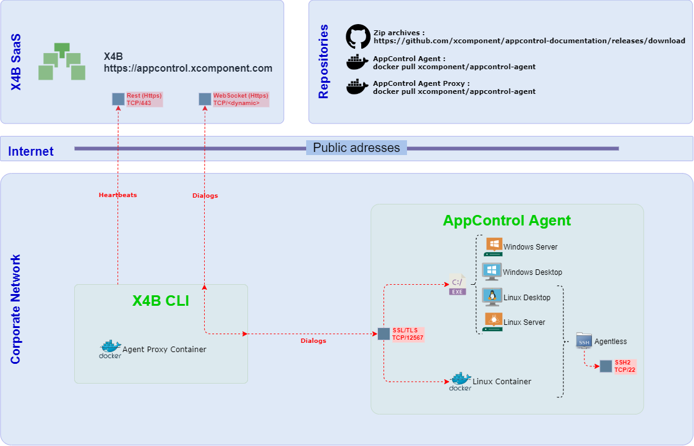
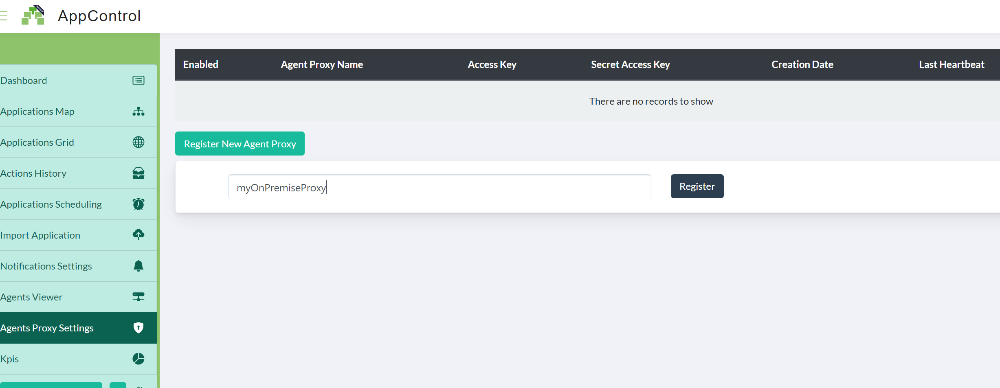
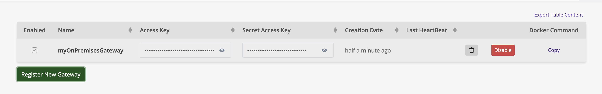

# X4B Gateway


## Latest Available versions

| Operating System | Format| Latest version |
| -----------------|------|------------|
| Microsoft Windows | zip | [Windows Gateway Zip](https://github.com/xcomponent/appcontrol-documentation/releases/latest/download/x4bgateway.zip) |  
| N/A|  docker | docker pull xcomponent/x4b-gateway:latest |


X4B Gateway is necessary to take advantage of agents deployed on premises.

Agents can be deployed anywhere on your I.S. They don't need to have an internet access.

Please refer to the agents installation section for agents installation.



Thanks to X4B Gateway, you can deploy your applications in the AppControl Cloud Platform with Agents deployed on premises.

#### How it works ?

The first step, is to go log-in on [AppControl](https://appcontrol.xcomponent.com).

1. Navigate to **Gateways** and click on \*\*Register New Gateway"
   

2. Give a name, to your gateway and validate.

3. Once your gateway is created, an AccessKey and a SecretAccessKey are generated.



4. We are ready to install the X4B Gateway. Please refers to the below documentation for the installation procedure.
5. Because X4B Gateway communicates with agents you need to install at least one agent.
6. Once your X4B Gateway and your agent are up and running your are ready to deploy a new application.

### X4B Gateway installation

The first step is to retrieve the X4B Gateway credentials. Navigate to the **Gateway** page and note the following informations:

- Agent Proxy Name
- Access Key
- Secret Acces Key


## Microsoft Windows Platform

On Microsoft Windows, the [.NET Framework 4.7.2](https://dotnet.microsoft.com/download/dotnet-framework/net472) or above is required .

Most of the time it is already installed. Unzip the following [file](https://github.com/xcomponent/appcontrol-documentation/releases/latest/download/x4bgateway.zip).

On a prompt (cmd.exe), execute the following command line.
Replace MY_ACCESS_KEY, MY_SECRET_ACCESSKEY and MY_PROXY_NAME with the suitable values.

```console
c:\x4b> x4b appcontrol run -a MY_ACCESS_KEY -p MY_SECRET_ACCESSKEY -n MY_PROXY_NAME -l Trace
```

You can also, set the following environment variables:

```console
c:\x4b> set X4B_ACCESS_KEY = MY_ACCESS_KEY
c:\x4b> set X4B_SECRET_ACCESS_KEY = MY_SECRET_ACCESSKEY
c:\x4b> set X4B_PROXY_NAME: = MY_PROXY_NAME
```

Once these environment variables are set, you can run the gateway using the following command line:

```console
c:\x4b> x4b appcontrol run -l Trace
```

If the configuration is correct, you should observe the following lines in the terminal:

```console
  __  ______ ___  __  __ ____   ___  _   _ _____ _   _ _____
 \ \/ / ___/ _ \|  \/  |  _ \ / _ \| \ | | ____| \ | |_   _|
  \  / |  | | | | |\/| | |_) | | | |  \| |  _| |  \| | | |
  /  \ |__| |_| | |  | |  __/| |_| | |\  | |___| |\  | | |
 /_/\_\____\___/|_|  |_|_|    \___/|_| \_|_____|_| \_| |_|


XComponent For Business by Invivoo Software - 2021
25/02/2021 09:15:20# X4B Proxy is up and running... (Press Ctrl+C to exit)
25/02/2021 09:15:21# Waiting for websocket connection
25/02/2021 09:15:39# HeartBeat successfully published
25/02/2021 09:15:39# Websocket connection established

```

## Deployment using Docker

The docker image is available on docker hub: [x4b-gateway](https://hub.docker.com/r/xcomponent/xcomponent/x4b-gateway)

```console
docker run -e X4B_ACCESS_KEY=MY_ACCESS_KEY -e X4B_SECRET_ACCESS_KEY=MY_SECRET_ACCESSKEY -e X4B_PROXY_NAME=MY_PROXY_NAME xcomponent/x4b-cli:latest
```

If the configuration is correct, you should observe the following lines in the terminal:

```console
  __  ______ ___  __  __ ____   ___  _   _ _____ _   _ _____
 \ \/ / ___/ _ \|  \/  |  _ \ / _ \| \ | | ____| \ | |_   _|
  \  / |  | | | | |\/| | |_) | | | |  \| |  _| |  \| | | |
  /  \ |__| |_| | |  | |  __/| |_| | |\  | |___| |\  | | |
 /_/\_\____\___/|_|  |_|_|    \___/|_| \_|_____|_| \_| |_|


XComponent For Business by Invivoo Software - 2021
25/02/2021 09:15:20# X4B Proxy is up and running... (Press Ctrl+C to exit)
25/02/2021 09:15:21# Waiting for websocket connection
25/02/2021 09:15:39# HeartBeat successfully published
25/02/2021 09:15:39# Websocket connection established

```
