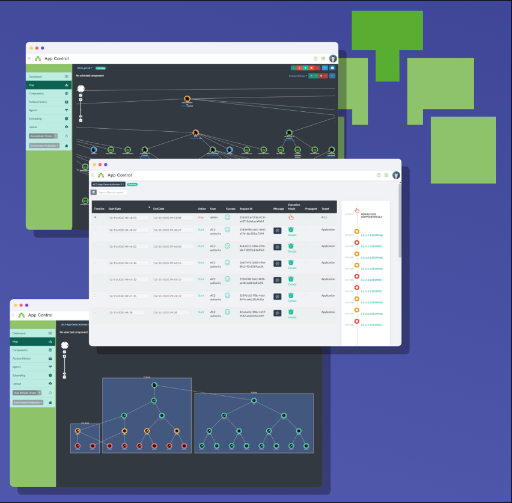
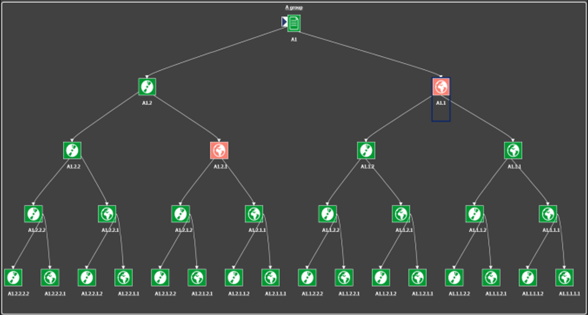
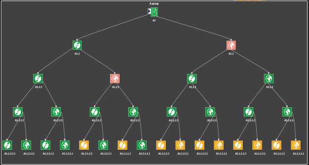
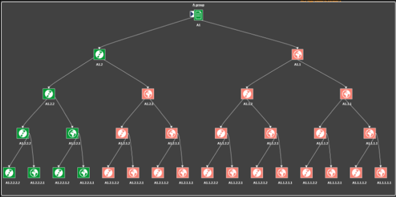
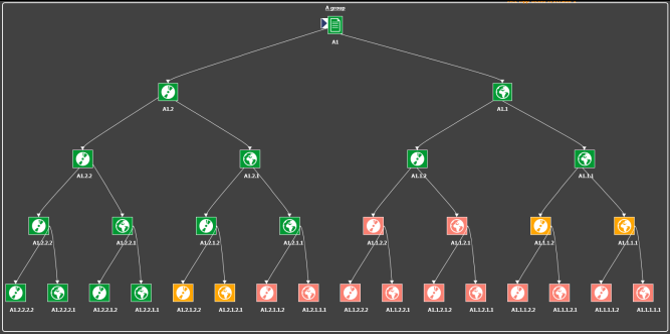
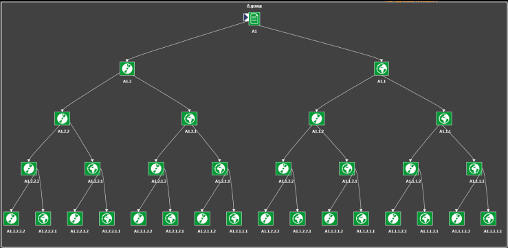

## XComponent Appcontrol Documentation

AppControl reduces your applications downtimes by letting you react quickly to an ongoing incident.
Supplementing your existing monitoring and supervision tools, AppControl acts on your applications to restart, repair, execute custom actions on your production systems.

AppControls empowers your teams, increases their confidence level and lowers their stress during incidents:

## KEY CONCEPTS

- Find root cause with no human intervention
- Eliminate human error when restarting
- Keep operational procedures tested and up-to-date

App Control allows you to both monitor the status of applications in real time but **above all to act** when an icident occurs.
Where monitoring software signals you problems, App Control offers to correct them.

## HOW IT WORKS

In APP CONTROL, an application is a hierarchy of components.   A component have several commands:

- A check command to retrieve the current state
- A start command
- A stop command
- And some optionals custom commands

- #### Dependencies behaviour
- A component can only starts if its parent's components are started.
- A component can only stops if its children's components are stopped.

#### 1. Diagnostic

In this situation, there are 2 issues:

- 2 components are stopped whereas there parents are started

--> APP CONTROL has detected the issues.

#### 2. Resolution

1. APP CONTROL stops orphans components

2. Healthy situation, we ready to restore the services

3. Restart by branch
   

4. Normal situation

## Get Started

- Go to the [XComponent App Control website](https://appcontrol.xcomponent.com).
- Log in using a social provider
- That's all, you are logged!

In the example section, retrieve the helloworld,v1.xml demo application.

On the App Control website, go to the Import Application and select "Use Default Agent".
Because you don't have installed your own agent yet, select "Use Default Agent".
Click on **Import** button.

Go the dashboard, and select the helloworld application by clicking on the checkbox.
Then click on the load button.

Your application is loaded:

Click on the map button:

Using, the command bar, it's easy to start/stop the Hello World application.

## Q/A

1. Does APP Control replace the monitoring tools (Nagios, Centreon, ...) ?

No, App Control is not intended to replace these tools. It is possible to rely on these probes and add additional action commands.
Indeed, Check commands of App Control can be based of
