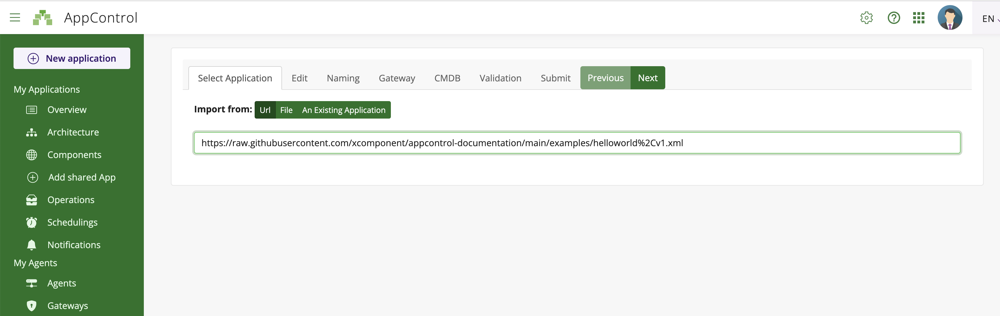

# Get Started

- Go to the [XComponent AppControl website](https://appcontrol.xcomponent.com).
- Log in using a social provider
- That's all, you are logged!

In the example section, copy the following link to the demo application: [demo application](https://raw.githubusercontent.com/xcomponent/appcontrol-documentation/main/examples/helloworld%2Cv1.xml).

On the AppControl website, go to the Import Application and paste the link of the [demo application](https://raw.githubusercontent.com/xcomponent/appcontrol-documentation/main/examples/helloworld%2Cv1.xml).

Follow the wizard (clicking on 'Next' button). In the **'Gateway'** tab select 'X4B SaaS'. On the last tab click on **'Import'**.

Go the **'Overview'**, and select the helloworld application by clicking on the checkbox.
Then click on the load button.

Click on the **'Architecture'** button:

Using, the command bar, it's easy to start/stop the Hello World application.

