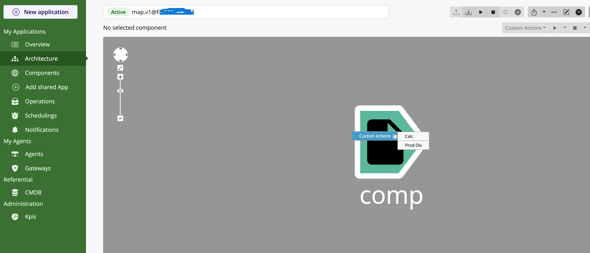
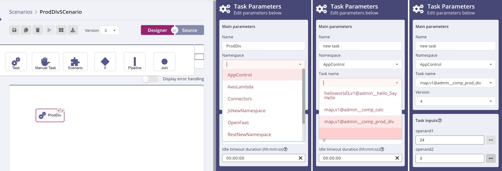

# Contents

This document describes how to use AppControl to execute a script or program as
a task in XC Scenario. It shows how to define the script invocation in an
AppControl map, how to test it directly from AppControl, and finally how to use
it from Scenario.

## Benefits of using AppControl

There are many advantages to running scripts through AppControl, as opposed to
running them directly from a worker task:
  
* the use of an AppControl agent for execution makes it easy to run scripts on
  remote machines, without requiring the script author to manage remote
  connections and logins himself

* executions through AppControl will benefit from monitoring and supervision by
  the production support team

* defining script calls in an AppControl map allows for better tracking and
  management of the script code base

# Pre-requisites

This document assumes that you have access to a working X4B installation,
either [Invivoo's SaaS platform](https://x4b.xcomponent.com/), or an X4B
platform deployed on your premises.

This includes XC Scenario, XC AppControl, and an AppControl worker (detailed
below) deployed and configured to interact with this AppControl instance.
Contact the administrator of your X4B platform to make sure that all the
required components are available and properly configured.

## AppControl Worker

The AppControl worker is a standalone program that acts as a worker program for
Scenario:

* it publishes a catalog of tasks
* it polls the task queue for tasks to execute
* it runs tasks and posts task statuses

Unlike other worker programs that implement their own tasks, the AppControl
worker:

* gets its list of tasks from custom actions in AppControl maps
* runs tasks by calling custom actions that get executed by an AppControl agent

The AppControl worker must be configured to communicate with an AppControl
server through a _gateway_, which is defined inside AppControl, and is
associated with a specific AppControl user.

# Defining scripts for the AppControl worker

Scripts that are meant to be used with the AppControl worker need to be defined
inside an AppControl map, as custom actions attached to some AppControl
component.

## Custom actions

A custom action is defined by an `action` element (inside a `component`
element) with a `name="custom"` attribute. Other important attributes are
`commandname`, which lets you identify each custom action, and `value`, which
holds the actual command to execute.

The contents of the `value` attribute are sent to the AppControl agent for
execution, so the platform where the agent is running determines the actual
shell script language to use, Windows command/batch script or linux/unix-like
shell script.

The `action` element can have `parameters` and `outputParameters` sub-elements,
for input and output parameters, respectively.

The `action` element also has a `visibility` attribute, which controls whether
the action is accessible from outside AppControl or not. The AppControl worker
only retrieves public tasks, so if a custiom action is to be used with Scenario,
it is mandatory to specify `visibility="public"`.

See the [AppControl map documentation](../map.md) for more details.

### Example

The following XML snippet is an excerpt from an AppControl map that defines a
component named `"comp"` (you can find the map file [here](map,v1.xml)). This
component has a `check` action (mandatory) and two custom actions named `calc`
and `prod_div`.

``` xml
<component name="comp" description="Script execution component" hostref="LOCAL" authref="LOCAL" redirectoutput="false" type="file">
    <action value="echo 1" name="check" />

    <action value="C:\a\bin\calc_script.cmd $(arg)" commandname="calc" name="custom" visibility="public">
        <parameters>
            <parameter name="arg" value="" canedit="true" validation="*" />
        </parameters>
    </action>

    <action value="py c:\a\bin\pycalc.py $(operand1) $(operand2)" commandname="prod_div" name="custom" visibility="public">
        <parameters>
            <parameter name="operand1" canedit="true" validation="\d+" />
            <parameter name="operand2" canedit="true" validation="\d+" />
        </parameters>
        <outputParameters>
            <parameter name="product" />
            <parameter name="division" />
        </outputParameters>
    </action>

</component>
```

The `calc` action has a single input parameter named `arg`, defined in the
`parameters/parameter` element, and referenced with the `$(arg)` inside the
`value` attribute. This action will run the Windows command line file found at
**`C:\a\bin\calc_script.cmd`** on the agent's machine, passing it the value of
the `arg` parameter (script file [here](calc_script.cmd)).

The `prod_div` action has both input and output parameters. It runs a python
script with two input parameters, calculating the product and division of these
two operands, and returning those two values. The `outputParameters` element is
used to list the names of the return values, so they can be added to the task's
description in the Scenario task catalog, and also identified in the script's
output stream
(see [A script with output parameters](#A-script-with-output-parameters)
below).

## Running custom actions in AppControl

Once the custom actions have been defined in the map file, as above, the map
must be imported into AppControl, using the **New** button in the UI. Please
refer to
the
[AppControl documentation](https://xcomponent.github.io/appcontrol-documentation/) if
you need more information on how to use the AppControl UI.

When the `Architecture` tab is chosen to display the map's graph, the
components from the map are shown, and any custom actions defined on them will
be found on a dropdown menu accessible through a right-click:



### A simple script

If we pick the `calc` action, a dialog box (on the left) shows the command line
that will be executed, as well as the arguments that are expected (in this
case, the single parameter `arg`). Enter a value for the argument, and press
the **Execute Custom Action** button. The dialog box (on the right) now
displays the status of the execution, which can be **InProgess**, while it's
running, and then **Execution Succeeded** as shown here when it's finished,
with the exit code from the script on the right-hand side.


As scripts usually produce output from their execution by printing to their
standard output stream, the AppControl custom action captures that output
stream and displays it on the screen, below the green status line. In this
case, it's the message `calc_script: arg=hello` that was printed by the script.

### A script with output parameters

A shell script does not have a notion of output parameters. But in many
situations, people write code that produces results, and we want to retrieve
those results, either for displaying in the AppControl UI, or for communicating
them to Scenario so they can be used by other tasks. 

This second example, the `prod_div` action, illustrates this use case with a
python script that returns two output parameters, and it explains the
particular syntax that's used, in the script's standard output stream, to
represent return values so Scenario get use them.

The `pycalc` script (source code [here](pycalc.py)) calls a python function
that calculates the product and division of its two operands. If we pick the
`prod_div` action in AppControl, the dialog box will shows us the command line
and input arguments (`operand1`, `operand2`), and after executing the action,
we'll also see the standard output, as before.


However, in this case, we see that the standard output has a very specific
format:

``` xml
<appcontrol>
    {
        'Message': 'pycalc: success.',
        'OutputValues': {
            'product': 72,
            'division': 8.0,
         }
    }
</appcontrol>
```

Inside the **&lt;appcontrol>** tags is an object with json/javascript syntax,
that is meant to be interpreted by the AppControl worker:

* the `Message` property holds some text that will be displayed in the Scenario
  UI, so it should be some kind of summary or resulting status from the
  script's execution.
  
* the `OutputValues` property is a dictionary of the output parameters. It must
  match the set of parameters listed in the `outputParameters` element of the
  AppControl map (see [Custom action example](#Example) above), and the values
  must be filled in by the script.
  
## Running scripts/custom actions in Scenario

So far, we've seen how to define our scripts in the AppControl map, and how to
run them from the AppControl UI. This section deals with using those scripts
inside Scenario.

If everything has been set up correctly by your administrator, as described
in [Pre-requisites](#Pre-requisites) above, importing and loading (activating)
the map that defines your scripts is enough to make them available in
Scenario. The AppControl worker publishes all the custom actions from your map
as Scenario tasks, in a namespace called **AppControl**.

# Using the script as a Scenario task

In the Scenario designer, when creating or modifying a scenario definition,
drag and drop an automatic task object (the one with the gears icon, called
**Task**), and select the **AppControl** namespace in the Task Parameters
panel. In the list of tasks, you can see two tasks from the **`map,v1.xml`**
file, with names:

* map,v1@admin\__comp_calc
* map,v1@admin__comp_prod_div

The structure of these names reflects the AppControl artifacts:
&lt;map>@&lt;user>\__&lt;component>\_&lt;action>. These actions are now
available, like any other task, to be used in your scenario.



Select the `prod_div` task, enter values for operands 1 and 2, and then run the
scenario. In the cockpit, you can see the output values and the message, just
as we saw in the AppControl UI above:


