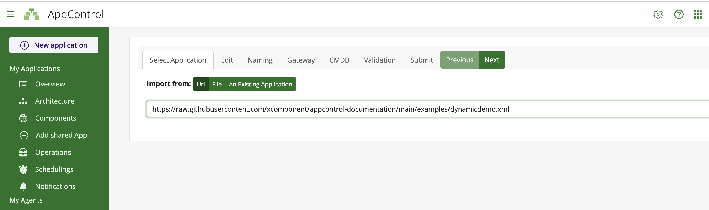

# Dynamic informations

An application, is a set of components defined statically with an xml format (cf: [Create an application](./../map.md)).
Nevertheless, the application can be enriched with dynamic informations.
Dynamic informations are returned by the 'check' command.

To return dynamic informations the 'check' command should log on the standard output some informations. The informations should respect the following format:
```xml
<appcontrol> APPCONTROL JSON OBJECT </appcontrol>
```

Dynamic informations can enrich the content of the component owning the 'check'. In dynamic informations start/stop commands are not allowed.

The JSON format is the following:

```json
{
    "link": "Hyperlink to wathever you want", //Optional
    "name": "Name of the component",          //Required
    "displayName": "Display name",            //Optional
    "state": "  Initializing | 
                InError |
                Start |
                Starting |
                Started |
                Stop |
                Stopping |
                Stopped ",     //Optional
    "parents":                 //Optional but highly recommanded
    [
        "Parent1",
        "Parent2",
    ],
    "exitCode": 256, //Optional
    "color": "Color of the code RGB format or hexa code ('255,255,255' or #FFFFFF", //Optional
    "Type": " Used to display an icon on the map. An url to an image (png, jpeg or svg) can be set. Anyway you can use one of the following value: browser, cd, chip, data-information, devises, dollar, euro, file, green-thermometer, hdd, memflash, memory, middleware, network, orange-thermometer, pounds, process, service, tools, user, yen",  //Optional
    "groupName": "Name of the group",  //Optional
    "customActions": //Optional
        [
            {
            "visibility": "Private",
            "customActionName": "echo Action",
            "customActionDescription":  null,
            "customActionCommandLine": "echo $(message)",
            "parallelCustomAction": false,
            "parameters":
            [
                {
                    "parameterName":"message",
                    "description": "",
                    "defaultValue": "Welcome message",
                    "validationRule": "*",
                    "isEditable": true
                }
            ]
            }
        ],
    "filters": {"filter name 1": ["filter values"] ,
                "filter name 2": ["filter values"]
                }  //Optional,
    "dynamicTree" : [
            {
                //A json object with the properties defined above
            }
    ] //Optional,
}
```

A full example is available in this documentation:
- [Application Xml](../../examples/dynamicdemo.xml)
- [JSON dynamic data](../../examples/dynamic.json)

The application should be tested this way. 

1. First copy this the link to the application: [Application](https://raw.githubusercontent.com/xcomponent/appcontrol-documentation/main/examples/dynamicdemo.xml)
2. Go to the **New Application** menu and import the previous application
   
3. Once the application is loaded go to the **Architecture** menu, you should obtain the following rendering:
   

On the above screenshot, you can observe that dynamic components are displayed with an 'octagon form' whereas the 'static component' is displayed with a 'square form'.


