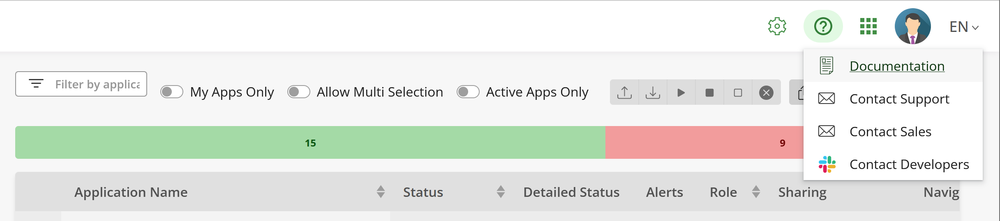

# Running AppControl Locally with Docker Compose

This package lets you install and run Invivoo's X4B AppControl software locally
on a Windows PC. To install X4B AppControl in standalone under Windows
OS, unzip the
following
[file](https://github.com/xcomponent/appcontrol-documentation/releases/latest/download/appcontrol-standalone.zip) into
an installation directory, and move into that directory.


## What is AppControl?

Invivoo's [X4B Platform](https://x4b.xcomponent.com/) lets companies integrate
all their business processes, activities, and systems in a global, data-driven
model, providing multi-team collaboration, profile-based user dashboards, with
the possibility to trigger actions directly, turning raw data into actionable
insights. This helps eliminate wasted time and energy, allowing organizations
to achieve operational efficiency, and succeed in their digital transformation.

**AppControl** is a central component of the X4B Platform. It supports the
intelligent management and monitoring of your applications and systems, through
a visual dashboard where the dependencies between the various components of
your applications are represented as a graph, and used to start and stop
applications and services in the correct order.

AppControl comes with a standard set of actions to manage application
components, and you can add your own custom actions to query specific
information or trigger specific processing on the application.

## AppControl License and Usage Terms

AppControl is free to use for educational purposes. For production use, please
contact [Invivoo](mailto:sales@xcomponent.com).

## Installing AppControl Locally

The AppControl software is delivered as a set of container images, meant to be
run inside a container orchestrator such
as [Kubernetes](https://kubernetes.io/) or Red Hat's
[OpenShift](https://www.redhat.com/en/technologies/cloud-computing/openshift).
Invivoo provides [Helm](https://helm.sh/) charts for this installation, which
is the recommended deployment method for production environments.

For a newcomer discovering AppControl for the first time, Invivoo is providing
this deployment method,
using [Docker Compose](https://docs.docker.com/compose/), to make it easy to
quickly set up an AppControl instance locally, on your laptop, and immediately
start exploring its possibilities.

AppControl includes a gateway and agents that will let you manage any system,
local or remote, from this local instance. Conversely, remote workstations will
also be able to access and use this instance, meaning the AppControl web-based
UI will be accessible from every machine on your network.

Note that this setup is NOT recommended for production deployments.

### Requirements

You will need [Docker Desktop](https://www.docker.com/products/docker-desktop/)
on your PC. Invivoo recommends choosing **WSL 2** over Hyper-V for the Linux
virtualization (see installation instructions below).

You will need at least 16 Gb of RAM and 5 Gb of available disk space.

### Installation Instructions

#### Docker Desktop

To install the latest version of Docker Desktop, follow
the [instructions](https://docs.docker.com/desktop/windows/install/) on their
web site.

In the **System Requirements** section, choose WSL 2 backend, and follow the
instructions from Microsoft to enable the feature and install WSL.

#### AppControl with Docker Compose

Docker Compose is a tool for defining and running multi-container Docker
applications. Invivoo provides the `appcontrol.yml` file to configure
AppControl's services. This lets you create and start all the services with a
single command.

Make sure that Docker Desktop is started. Open a command line tool (a normal
one, administrator rights are **not** required), and run the following command:

```bash
docker-compose -f appcontrol.yml -f appcontrol-images.yml up -d
```

The command will start by retrieving all the required container images from
Invivoo's [DockerHub](https://hub.docker.com/u/xcomponent) repository, this may
take a few minutes. After that, the containers are started with the `docker
run` command. Subsequent runs will reuse the locally-stored images.

When the command has finished executing, you should see an output like the
following:

``` console
 - Network appcontrol-compose_default                  Created                            0.8s
 - Container appcontrol-compose-rabbit-1               Started                            8.4s
 - Container appcontrol-compose-gateway-1              Started                            8.5s
 - Container appcontrol-compose-agentdebian-1          Started                            8.9s
 - Container appcontrol-compose-login-1                Started                            8.9s
 - Container appcontrol-compose-sql-1                  Started                            9.0s
 - Container appcontrol-compose-redis-1                Started                            8.3s
 - Container appcontrol-compose-webapp-1               Started                            8.8s
 - Container appcontrol-compose-notification-1         Started                           12.6s
 - Container appcontrol-compose-api-1                  Started                           15.8s
 - Container appcontrol-compose-configvalidator-1      Started                           12.2s
 - Container appcontrol-compose-agentmanager-bridge-1  Started                           15.3s
 - Container appcontrol-compose-dbaccess-1             Started                           13.7s
 - Container appcontrol-compose-scheduler-1            Started                           14.5s
 - Container appcontrol-compose-launcher-1             Started                           14.8s
 - Container appcontrol-compose-launcher-dispatcher-1  Started                           10.3s
 - Container appcontrol-compose-statistics-1           Started                           14.4s
 - Container appcontrol-compose-agentmanager-1         Started                           15.2s
 - Container appcontrol-compose-agentstatus-1          Started                           15.3s
 - Container appcontrol-compose-apps-1                 Started                           17.3s
 - Container appcontrol-compose-authentication-1       Started                           21.0s
```

The AppControl services are up and running.

### Using the Web Interface

In your web browser, navigate to [http://localhost:4000](http://localhost:4000)
to access the AppControl webapp. Use the following credentials to login:

- login: `admin`
- password: `KoordinatorAdmin`

### Getting Help

Once you're logged into AppControl, you can access the online documentation
through the help button (?) on the top right of the screen:



The dropdown menu also lets you contact Invivoo support through email, and join
our Slack channel for access to the development team.

#### Test AppControl with the Helloworld map

The installation package includes a sample AppControl map to help you get
started. In the webapp, import the sample map by clicking on the **New
application** button and uploading the file called `hellowworld,v1.xml`.

Here's a tutorial video to help you get
started:
[Helloworld tutorial](https://www.loom.com/share/a19d45ebc33c4aed9157a15e596cb10a)

### Stop / Uninstall AppControl

Run the following command to stop AppControl:

```bash
docker-compose -f appcontrol.yml -f appcontrol-images.yml stop
```

If you want to start again, run the following command:

```bash
docker-compose -f appcontrol.yml -f appcontrol-images.yml up -d
```

To completely remove AppControl, run the following command:

```bash
docker-compose -f appcontrol.yml -f appcontrol-images.yml rm
```

