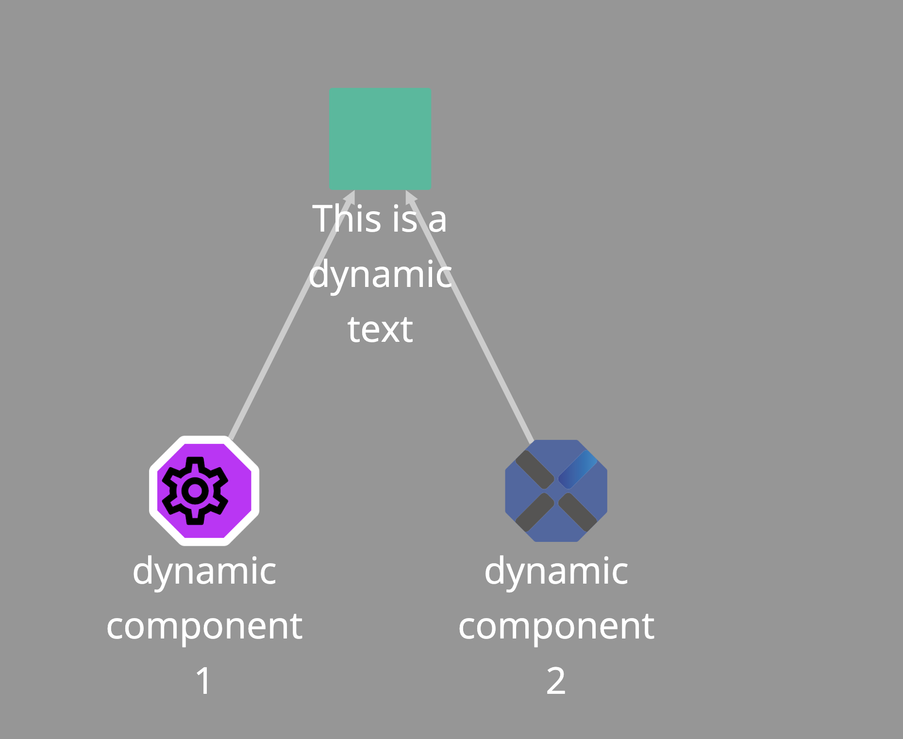

# Dynamic informations

An application is a set of components defined statically using a YAML/XML format (see: [Create an application](map.md)). However, the application can be enriched with dynamic information. Dynamic information is returned by the `check` command.

To return dynamic information, the `check` command should log some data to the standard output, which must follow this format:

```xml
<appcontrol> APPCONTROL JSON OBJECT </appcontrol>
```

```json
{
    "link": "Hyperlink to wathever you want", //Optional
    "name": "Name of the component",          //Required
    "displayName": "Display name",            //Optional
    "state": "  Initializing |
                InError |
                Start |
                Starting |
                Started |
                Stop |
                Stopping |
                Stopped ",     //Optional
    "parents":                 //Optional but highly recommanded
    [
        "Parent1",
        "Parent2",
    ],
    "exitCode": 256, //Optional
    "color": "Color of the code RGB format or hexa code ('255,255,255' or #FFFFFF", //Optional
    "Type": " Used to display an icon on the map. An url to an image (png, jpeg or svg) can be set. Anyway you can use one of the following value: browser, cd, chip, data-information, devises, dollar, euro, file, green-thermometer, hdd, memflash, memory, middleware, network, orange-thermometer, pounds, process, service, tools, user, yen",  //Optional
    "groupName": "Name of the group",  //Optional
    "customActions": //Optional
        [
            {
            "visibility": "Private",
            "customActionName": "echo Action",
            "customActionDescription":  null,
            "customActionCommandLine": "echo $(message)",
            "parallelCustomAction": false,
            "parameters":
            [
                {
                    "parameterName":"message",
                    "description": "",
                    "defaultValue": "Welcome message",
                    "validationRule": "*",
                    "isEditable": true
                }
            ]
            }
        ],
    "filters": {"filter name 1": ["filter values"] ,
                "filter name 2": ["filter values"]
                }  //Optional,
    "dynamicTree" : [
            {
                //A json object with the properties defined above
            }
    ] //Optional,
}
```

A full example is available in this documentation:

-   [Application sample](../examples/dynamicdemo.xml)
-   [JSON dynamic data](../examples/dynamic.json)

In this example, dynamic components are displayed with an octagonal shape, while static components are displayed with a square shape.


