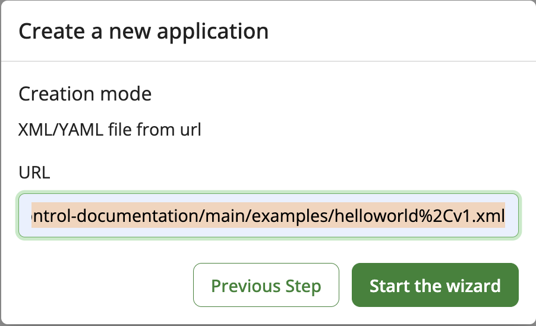

# Getting Started with AppControl

AppControl is designed as a simple, cloud-based **Software as a Service (SaaS)** solution, allowing you to monitor and manage your applications from anywhere, without the need for complex on-premises infrastructure. This quick-start guide will help you set up and begin using AppControl in minutes.

For businesses with specific requirements—whether it’s tailored SLAs, on-premises deployment, or other custom needs—please **<a href="https://ask.invivoo.com/appcontrol" target="_blank">Contact us</a>** to discuss how we can meet your specific goals.

<h2 id="try-demo">Try AppControl with a Demo (No Local Setup Required)</h2>

To help you get started quickly, AppControl offers a demo environment that allows you to explore the core features of the platform without the need for any local setup or infrastructure. This is the perfect way to understand how AppControl can reduce downtime and streamline incident response.

-   **Log in**: </br> - Go to the [XComponent AppControl website](https://appcontrol.xcomponent.com) </br> - Log in using a social provider </br> - You're done! You can now get started with AppControl!
-   **Import a demo application**: </br>

Click on the Overview/New Application button, select XML/YAML file from url and paste the following link of an "Hello World" application.

<div style="display: flex; align-items: center;">
  <!-- Hidden input field that holds the link -->
  <input type="text" value="https://raw.githubusercontent.com/xcomponent/appcontrol-documentation/main/docs/en/examples/helloworld%2Cv1.xml" id="linkInput" readonly style="position: absolute; left: -9999px;">
  
  <!-- Button with copy icon -->
  <button onclick="copyLink()" style="background-color: #007bff; color: white; border: none; padding: 10px; cursor: pointer; border-radius: 5px; display: flex; align-items: center;">
    
    Copy Application Link
  </button>
</div>

<script>
function copyLink() {
  var copyText = document.getElementById("linkInput");
  copyText.select();
  document.execCommand("copy");
  alert("Link copied: " + copyText.value);
}
</script>

</br>

{ :style="width: 300px; height: auto; margin-right: 15px;" }
{ :style="width: 200px; height: auto; margin-right: 15px;" }

Follow the wizard (clicking on 'Next' button). In the **'Agent/Gateway configuration'** section select 'SaaS Gateway'. Then scroll down on the bottom of the page and click on "Create my application".

{: style="width: 500px; height: auto; margin-right: 15px;" }

-   **Explore the UI**: Explore monitoring, incident management, and actions.

{: style="width: 500px; height: auto; margin-right: 15px;" }
{: style="width: 200px; height: auto; margin-right: 15px;" }

The demo version provides a hands-on look at AppControl’s capabilities.

## Some explanations about the Demo YAML file

### YAML Configuration for "helloworld" Application

The YAML configuration file for the "helloworld" application defines how the application is monitored, controlled, and secured through AppControl. This guide explains the structure and objectives of the YAML file, allowing you to customize your own configurations.

#### Objectives of the YAML Configuration

The primary purpose of the YAML configuration file is to outline the application’s structure, define its components, and specify the actions AppControl will perform. It also describes how agents and authentication methods are used to securely communicate with and control the application.

#### Key Objectives

1. **Define the Application Name, Version, and Components**

    - The YAML file begins by specifying the application’s `Name` and `Version`, followed by its components. In this case, the component "hello" represents the main part of the "helloworld" application.

2. **Establish Agent-Based Monitoring and Control**

    - An agent, called `LOCAL`, is defined to manage the application. This agent communicates over port `12567` using the TLS 1.2 protocol for secure connections. The agent monitors the application’s state and can execute actions such as starting or stopping the application.

3. **Define Secure Authentication Mechanism**

    - The file includes an authentication method, `LOCAL`, to secure the communication between the agent and the application components. This ensures that only authorized agents can execute actions on the application.

4. **Configure Component Actions**
    - The YAML file defines a series of actions that AppControl can perform on the "hello" component:
        - **Check Action**: Checks the existence and content of the `hello.txt` file.
        - **Start Action**: Starts the application by creating the `hello.txt` file.
        - **Stop Action**: Stops the application by removing the `hello.txt` file.
        - **Custom Action**: Allows users to input a custom message and execute the "Say Hello" command.
5. **Group Components for Easier Management**

    - The `Group` field organizes components into logical groups for easier management. In this case, the "hello" component is grouped under "Hello group".

6. **Provide a Template for Automation and Customization**

    - The YAML file serves as a template for automating routine tasks, such as starting and stopping the application, while also allowing customization through user-defined actions.

7. **Ensure Scalability and Extensibility**
    - The structure of the YAML file allows you to scale and extend the configuration by adding more agents, components, or actions as needed for more complex applications.

---

### Example YAML Configuration

Here’s an example of the YAML configuration for the "helloworld" application:

```yaml
Name: helloworld
Version: v1
Icon: {}
Agents:
    - Name: LOCAL
      Port: 12567
      SslProtocol: tls12
Authentications:
    - Name: LOCAL
Components:
    - Name: hello
      Agent:
          AgentName: LOCAL
          AuthentificationName: LOCAL
      Icon:
          SystemName: file
      Group: Hello group
      Description: Hello World
      Actions:
          - Name: check hello
            Type: check
            Value: cat hello.txt
          - Name: start hello
            Type: start
            Value: echo hello > hello.txt
          - Name: stop hello
            Type: stop
            Value: rm hello.txt
          - Name: Say Hello
            Type: custom
            Value: echo $(message)
            InputParameters:
                - Name: message
                  Value: Hello
                  CanEdit: true
                  Validation: '*'
```

## Connecting to Local Infrastructure

If you wish to manage applications running in your on-premises environment, AppControl can be connected to your local infrastructure through **agents** and **gateways**. While this is an advanced setup, it allows for seamless integration with both legacy and cloud applications.

For detailed instructions on how to connect to your local infrastructure, including agent installation and gateway setup, please refer to the following pages:

-   [Setting up Agents](/pages/agents/)
-   [Configuring the Gateway](/pages/x4bcli/#x4b-gateway-custom-installation)
-   [Full Local Infrastructure Guide](/pages/x4bcli/)
