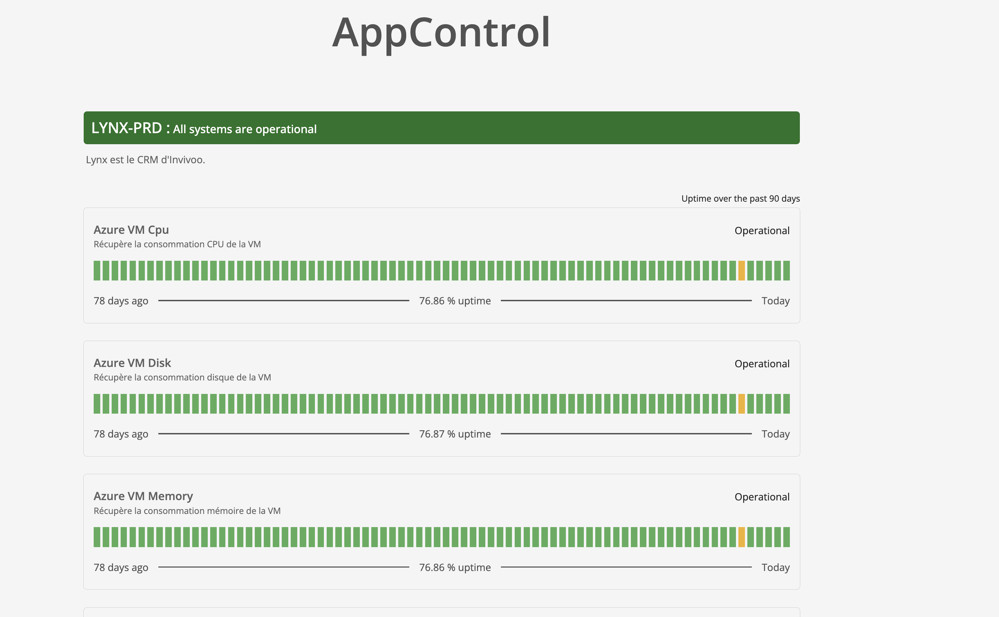

# Main Features of AppControl

AppControl offers a variety of features that help you monitor and manage critical business applications efficiently. Below is a list of the key features available in AppControl.

## 1. Application Dashboard

Monitor the status of your applications in real time.

-   **Main Statuses**:
    -   **Started**: Application is running as expected.
    -   **Stopped**: Application is not currently running.
    -   **Degraded**: Application is running but has performance or availability issues.
    -   **Error**: Application has encountered an error and needs attention.

## 2. Application Operations History

Track all changes and events related to your applications over time.

-   **Logs**: Detailed logs of when applications were started, stopped, or when any issues occurred.
-   **Audit trail**: A comprehensive view of all actions taken within the system.

## 3. Action Buttons: Start/Stop

Easily control the lifecycle of your applications.

-   **Start**: Quickly start any application.
-   **Stop**: Gracefully shut down applications.

1. Activate/Deactivate applications
2. Start aplication
3. Stop application
4. Cancel current operation (Start/Stop)
5. Force check actions
6. Edit current application
7. Display filters
8. Advanced settings
9. Show/Hide groups (groups are used to group components)

## 4. Custom Actions (On-Demand Actions)

Define and execute custom actions tailored to your application’s needs.

-   **Examples**:
    -   Diagnostics checks
    -   Cleanup tasks
    -   Restart specific components

## 5. Application Sharing Feature

AppControl offers a convenient feature for sharing applications with specific users. This can be done in two ways: either by generating a **sharing code**, which can be distributed among users to access the application, or by sharing the application **directly with a specific user** by entering their username. This feature simplifies collaboration and access management, ensuring the right users can easily interact with the applications they need.

## 6. Notifications

Stay informed of application statuses and incidents with integrated notification systems.

-   **Notification channels**:
    -   SMS alerts for critical events.
    -   Microsoft Teams notifications to keep your team updated in real time.

## 7. Status Page

The **Status Page** in AppControl provides a detailed overview of the availability and health of your critical applications. This page displays the **percentage of availability** for each application, allowing you to monitor uptime and quickly identify potential issues over the past few days.

## Key Features:

-   **Application Availability**: Shows the percentage of time each application was available and running smoothly, helping you assess the stability and reliability of your applications.
-   **Historical Data**: Analyze the performance of applications over a specific period (e.g., the last 7 or 30 days) to gain insights into trends or recurring issues.
-   **Color-Coded Indicators**:
    -   **Green**: High availability (e.g., > 75%)
    -   **Yellow**: Moderate availability (e.g., 50-75%)
    -   **Red**: Low availability or critical issues (e.g., < 50%)
-   **Interactive Graphs**: Visual representations of uptime fluctuations, making it easy to visualize downtime and availability trends.

This page helps ensure that your applications maintain high levels of availability and reliability by providing a clear and actionable view of their performance over time.

## 8. Integration with Legacy and Cloud Applications

Seamlessly monitor both legacy on-premise applications and cloud-native services without requiring any modifications to existing applications.

## 9. Automated Recovery

While automated recovery avoids restarting components by default, you can schedule auto restarts using built-in cron expressions to meet your operational needs.

---
