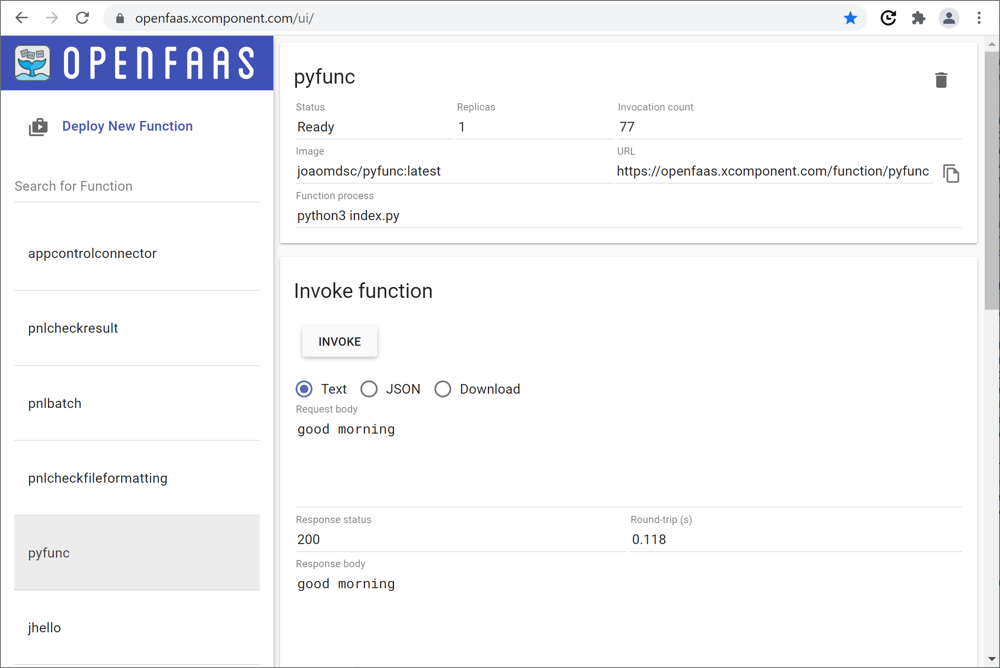
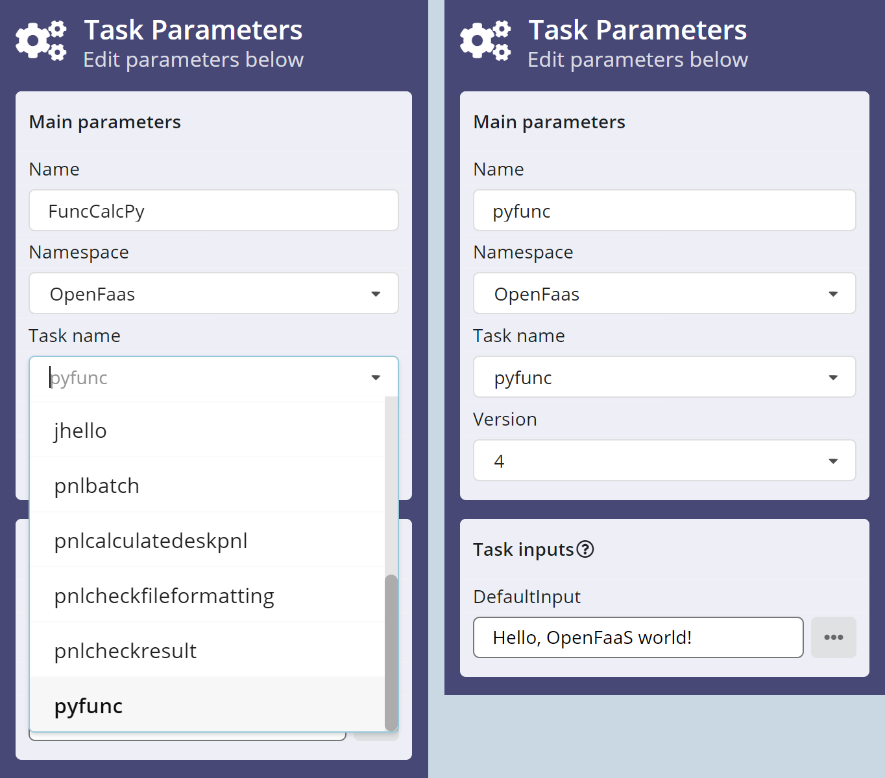
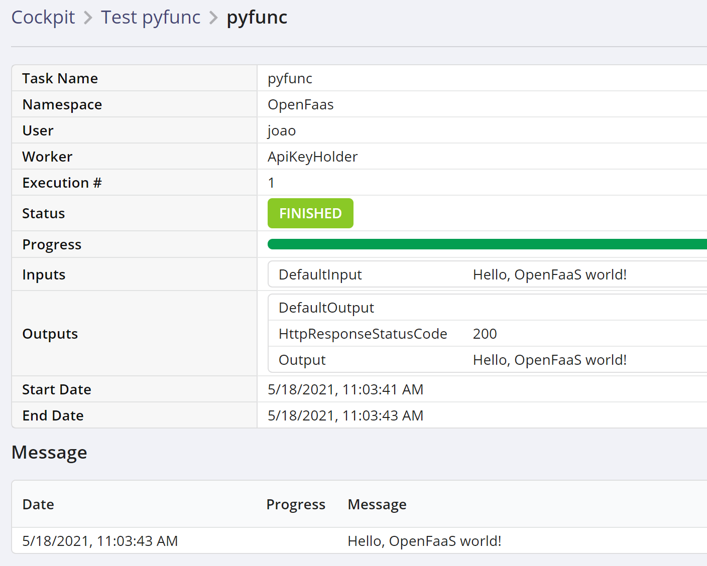
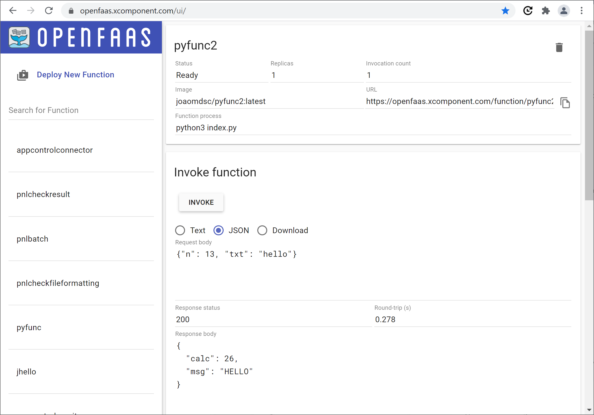
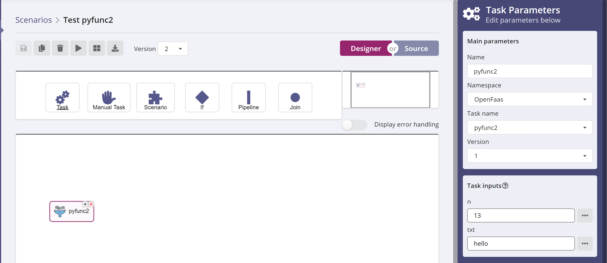
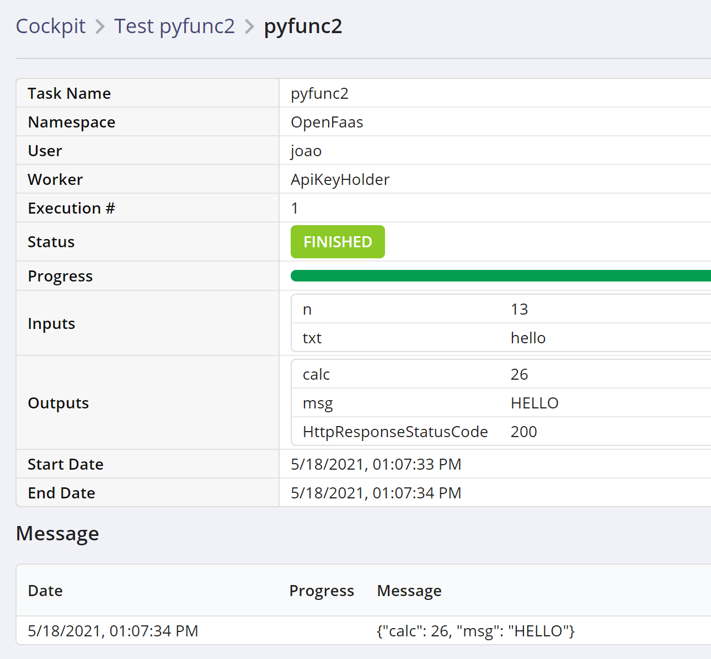

# Contents

This document describes how to write a simple, _synchronous_ python function
that is run inside OpenFaas, and that can be invoked from XC Scenario to
implement a scenario task. It details the integration with OpenFaas and the
mechanics of making your function available on the server. A separate document
will address the case of an _asynchronous_ function.

Note that OpenFaas supports writing functions in many programming languages
other than python, please have a look at the official
OpenFaas [documentation](https://docs.openfaas.com) for more information.

Part of this document is based on the
OpenFaas
[First Python Function](https://docs.openfaas.com/tutorials/first-python-function/) tutorial.

## OpenFaas and CLI Installation

This document assumes that you have a working OpenFaas installation, and you
will need to provide the URL for it. Contact an administrator if you don't have
this information. In our example, we'll be using
`https://openfaas.xcomponent.com` as the url for our OpenFaas server, or
gateway.

As part of the OpenFaas installation, the `faas-cli` executable should be in
your path. This is OpenFaas' command-line interface (CLI), and it is required
to perform a number of tasks, including building and deploying your functions,
so a set of valid credentials must be configured for it. Again, if needed,
contact the administrator responsible for your OpenFaas installation.

## Write a simple function

### Initialize the work environment

Create a working directory and move into it. Now scaffold a new Python function
using the CLI:

``` console
faas-cli new --lang python3 pyfunc
```

This retrieves a set of templates from GitHub, if needed, then creates the
following files:

``` console
pyfunc/handler.py
pyfunc/requirements.txt
pyfunc.yml
```

Again, this example uses python, have a look at
this [page](https://docs.openfaas.com/cli/templates/) to see what other
languages are available.

Note that even for a single language, many templates may be available. The
default for python is to use the Classic Watchdog, but the above link lists
many others.

### pyfunc.yml

This yaml file specifies your functions, and the OpenFaas gateway to use. The
`faas-cli new` command has already filled in most of this file:

``` yaml
version: 1.0
provider:
  name: openfaas
  gateway: http://127.0.0.1:8080
functions:
  pyfunc:
    lang: python3
    handler: ./pyfunc
    image: pyfunc:latest
```

You only need to change or specify the following items:

* the gateway, i.e. the url of your OpenFaas installation
* the docker image name
* the `com.xcomponent.label` property (to be added)

OpenFaas supports running functions from Docker images stored on Docker Hub or
in private Docker registries. If you decide to use Docker Hub, as we do in this
example, you'll need to include a Docker Hub account as the _prefix_ in the
image name (`joaomdsc` in this case, see below).

If you want to use a private registry for your images, this
[document](https://ericstoekl.github.io/faas/operations/managing-images/)
has information on how to specify the access credentials. 

XC Scenario defines a label (`Demo` in our example) that is used to filter the
functions that will be made available. That label must be referenced here, so
that your function can be used in XC Scenario. We'll use the
`labels.com.xcomponent.label` property to specify a value, which has to match
whatever value was configured in your installation of XC Scenario. Please
contact your X4B/Scenario administrator to find out the right label to use
here.

After applying these changes, here's what the modified `pyfunc.yml` file looks
like:

``` yaml
version: 1.0
provider:
  name: openfaas
  gateway: https://openfaas.xcomponent.com
functions:
  pyfunc:
    lang: python3
    handler: ./pyfunc
    image: joaomdsc/pyfunc:latest
    labels:
      com.xcomponent.label: Demo
```

### handler.py

The `handler.py` file is where the function code will be implemented. It starts
out with an almost empty function skeleton:

``` python
def handle(req):
    """handle a request to the function
    Args:
        req (str): request body
    """

    return req
```

The function has a single parameter `req` that will contain the body of the
HTTP request through which the function was invoked. The default implementation
in the provided template simply returns this string unchanged.

For the time being, we'll keep the function as it is, while we go through the
process of making the function available and running it from XC Scenario. Later
on, we'll see how to declare input and output parameters to communicate with a
running scenario instance, when the function is used to implement a scenario
task.

### Build the function

Run the following command to build the function:

``` console
joao@debian1:~$ faas-cli build -f pyfunc.yml
```

Note: OpenFaas builds a docker image for the function, so make sure that
`docker` is deployed on the machine.

On successful completion, you should see the following message:

``` console
Successfully tagged joaomdsc/pyfunc:latest
Image: joaomdsc/pyfunc:latest built.
```

You can check the presence of the docker image:

``` console
docker images
REPOSITORY                             TAG                     IMAGE ID            CREATED             SIZE
joaomdsc/pyfunc                        latest                  e7f810f4455f        23 minutes ago      62.1MB
```

Now push the image to DockerHub:

``` console
joao@debian1:~$ docker push joaomdsc/pyfunc:latest
```

### Deploy the function to the OpenFaas server

You can now deploy the function to the OpenFaas server, using the following
command:

``` console
joao@debian1:~$ faas-cli deploy -f pyfunc.yml
Deploying: pyfunc.

Deployed. 202 Accepted.
URL: https://openfaas.xcomponent.com/function/pyfunc.openfaas-fn
```

Check for the presence of a 202 return code. Also note that it might take a
minute or two for your function to be available.

### Test the function

You can invoke the function through `curl`, passing in a request body with the
`-d` argument:

``` console
joao@debian1:~$ curl https://openfaas.xcomponent.com/function/pyfunc -d "Hello!"
Hello!
joao@debian1:~$ 
```

The text that was passed in is returned by the function. 

You can invoke the function through `faas-cli`:

``` console
joao@debian1:~$ echo -n "Hello!" | faas-cli -g https://openfaas.xcomponent.com invoke pyfunc
Hello!
joao@debian1:~$ 
```

You can also invoke the function through the OpenFaas portal:



Click on `Request body`, enter some text (`good morning` for example), then
press `Invoke`.

### Use the function in XC Scenario

Create a new scenario, add a task, and pick the **OpenFaas** namespace. You
should find your new function in the list of tasks on the left (if your
function does not appear on the list, the label defined in `pyfunc.yml` may be
incorrect, check with your administrator).

Select `pyfunc` in the list. Note the **DefaultInput** field (on the right
image), enter some text value (`Hello, OpenFaas world!` in this example):



Now run the scenario, and check the cockpit. You should see the text you
entered displayed in the task output:




## Write a function with multiple parameters

Let's define a second, more realistic function, with input and output
parameters. We'll define a function called `pyfunc2` that takes two inputs, an
integer `n` and a string `txt`, and returns two outputs, an integer `calc` and
a string `msg`.

Repeat the above steps to create a new function called `pyfunc2`, and apply the
following changes.

### New pyfunc2.yml

In the yaml file, we apply the same changes as before (gateway, image name
prefix) but we also add new labels:

``` yaml
version: 1.0
provider:
  name: openfaas
  gateway: https://openfaas.xcomponent.com
functions:
  pyfunc2:
    lang: python3
    handler: ./pyfunc2
    image: joaomdsc/pyfunc2:latest
    labels:
      com.xcomponent.label: Demo
      com.xcomponent.inputs.n: Number
      com.xcomponent.inputs.txt: String
      com.xcomponent.outputs.calc: Number
      com.xcomponent.outputs.msg: String
```

The `com.xcomponent.inputs` properties define function _inputs_, and
`com.xcomponent.outputs` define function _outputs_. The parameter name is
appended to the property name, and the value indicates the parameter's type.

All the XC Scenario base types can be used : String, Number, Boolean.

### New handler.py

Replace the generated `handler.py` file with the following content:

``` python
import json

def handle(req):
    """handle a request to the function
    Args:
        req (str): request body
    """
    
    # De-serialize json, extract input parameters
    obj = json.loads(req)
    n = int(obj['n'])
    txt = obj['txt']

    # Implement your function here
    calc = 2*n
    msg = txt.upper()

    # Return the output parameters
    result = {
        'calc': calc,
        'msg': msg,
        }

    return json.dumps(result)
```

XC Scenario calls the OpenFaas functions with a json request body containing
the input parameters. The code de-serializes the json data and extracts the two
input parameters.

After this step, you can implement whatever processing your function needs to
do. In our example, the numeric parameter gets multiplied by 2, and the string
parameter is converted to uppercase.

The final step in the code is to return a json string encoding the output
parameters defined in the yaml file, so that XC Scenario can make them
available as task outputs.

### Build and deploy the new function

Repeat the above steps to build the new `pyfunc2` function, upload its docker
image to Docker Hub, and deploy it on the OpenFaas server.

### Test the new function

You can invoke the function from the command line as before; however, passing
json strings is cumbersome, as all the double quotes must be escaped, so it's
easier to put the input in a json file, let's call it `inputs.json`:

``` json
{
    "n": 13,
    "txt": "hello"
}
```

The `-d` option to the `curl` command supports the `@` syntax to specify a file
name, so the function can be invoke with the following command:

``` console
joao@debian1:~$ curl https://openfaas.xcomponent.com/function/pyfunc2 -d @inputs.json
{"calc": 26, "msg": "HELLO"}
joao@debian1:~$ 
```

It can also be invoked through the OpenFaas portal as before:



### Use the new function in XC Scenario

As before, create a new scenario, add a task, pick the **OpenFaas** namespace,
and select the `pyfunc2` function. The **Task Inputs** section shows the two
input parameters `n` and `txt`:



Enter some values, then run the scenario and check the cockpit for the function
output:



The output parameters display the results of the OpenFaas' function processing.
