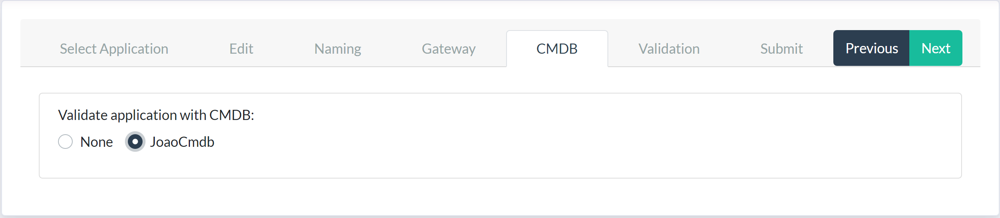
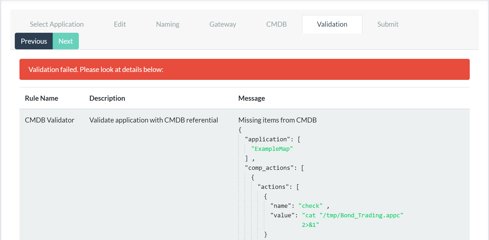

# AppControl CMDB Integration

AppControl can be integrated with a Configuration Management Database (cmdb).

AppControl currently supports [ServiceNow](https://www.servicenow.com/) as a
cmdb provider, but other providers such
as [iTop](https://www.combodo.com/itop-193) or [EasyVista](https://www.easyvista.com/) can also be considered. 

## Use Cases

There can be several use cases for integrating AppControl and a cmdb:

* conformity check between operational reality and cmdb referential
* map (eg: AppControl Application) provisioning based on cmdb data 

### Conformity check

In the first use case, whenever a map is loaded, AppControl checks whether the
objects declared in the map are present in the cmdb, and produces a report
listing the elements that were found missing.

Currently, nothing is ever **added** to the cmdb; a future version may offer
the possibility for the user to choose whether to populate the cmdb with
elements from the map.

### Map provisioning

In the second use case, the cmdb acts as the configuration repository for
AppControl artefacts, such as the Component. For example, the cmdb may hold a
standard set of actions that are expected to be present in certain components:
when the actions are found to be missing in the map, they can be copied from
the cmdb, ensuring that the Components in the operational reality match the
cmdb view of the world.

Eventually, it might be possible to generate entire maps from the cmdb, thereby
ensuring automatic conformity. 

## Cmdb Integration HOWTO

### Cmdb access and credentials

The first step is to define one or more cmdb objects in AppControl. In the
Referential section at the bottom of the left-hand side panel, press the CMDB
button to display the page where you can manage access to various CMDBs:


To register a new ServiceNow CMDB, press the register button and fill in the
fields:

* `Name` is the local AppControl identifier for this cmdb
* `User`/`Password` are your credentials on the ServiceNow server
* `ServiceNow Url` identifies the ServiceNow server you wish to use

Once a cmdb has been defined, you can reference it in the map import wizard, to
request a validation of the map being imported.

## Map Import Wizard

When importing a new map file, the fifth step is the CMDB validation, where you
are presented with the list of available cmdbs. 



Make sure the cmdb server you want to use is up and running at this
point. Click on its name and press Next. A progress bar indicates that
validation is taking place (this can take a few moments). If every element in
the map is matched to a corresponding element in the cmdb, a message will
indicate that the validation has succeeded:


If the verification process detected configuration information in the cmdb that
was not in the map (such as Component actions) this will also be indicated:


If any discrepancies were found when comparing the map to the cmdb, a report is
shown listing the elements that were found to be missing:



## Understanding the ServiceNow integration

The following sections detail the mapping choices that were made to represent
AppControl data in ServiceNow. Keep in mind that ServiceNow is very much
configurable, and even lets you define custom data tables, so any integration
might require specific work. 

### Mapping between AppControl and ServiceNow

The following table shows the correspondance between AppControl concepts or
objects, and ServiceNow resources.

| AppControl | ServiceNow Object | ServiceNow Table |
| --- | --- | --- |
| Application | Application  | cmdb_ci_appl |
| Host | Computer | cmdb_ci_computer |
| Component | Service | cmdb_ci_service |
| Component hostref | Computer-Service Relation | cmdb_ci_rel |
| Action | Commands | cmdb_running_process |

### Representing Components actions in ServiceNow

Each Component in AppControl has a mandatory `hostref` attribute linking to the
server where the component is hosted. This link is represented by a ServiceNow
`Depends on::Used by` relation.

The actions defined on a Component are stored in the RunningProcess table
(cmdb_running_process), with a link to the corresponding host. Here's the
detailed mapping on the fields of the RunningProcess table:

| AppControl Element | Field |
| --- | --- |
| name | _action name_ **::** _component name_ | 
| command | _action value_ |
| parameters | _application name_ |
| computer | _hostref_ | 

### Example

AppControl XML map file:

```xml
<app name="inv_test_missing_from_map" version="1.0">
  <component name="inv_pricing_001" description="An Invivoo component" group="A group"
	       hostref="inv_host_001" authref="LOCAL"redirectoutput="false" type="file">
    <action value="sandbox.sh check inv_pricing_001" name="check" />
    <action value="sandbox.sh enable inv_pricing_001" name="enable" />
    <action value="sandbox.sh disable inv_pricing_001" name="disable" />
  </component>
```

ServiceNow cmdb_running_process table record (extracts):

```json
{
    "command": "sandbox.sh check inv_pricing_001",
    "computer": {
        "link": "https://dev78474.service-now.com/api/now/v1/table/cmdb_ci_computer/8ba1aa202f7320102cd8d49df699b687",
        "value": "8ba1aa202f7320102cd8d49df699b687"
    },
    "name": "check::inv_pricing_001",
    "parameters": "inv_test_missing_from_map",
}
```

### Populating your Cmdb

The cmdb can be populated by inserting individual objects using the cmdb
provider's interface. But as the volume of data grows, populating your cmd can
become a daunting task. Invivoo is developing tools to automate the creation of
cmdb objects from AppControl maps [TO BE CONTINUED].
