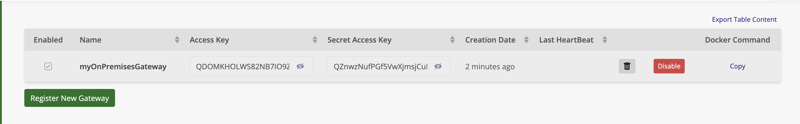

# Introduction

To fully utilize AppControl's capabilities with on-premises infrastructure, the X4B Gateway is required. The gateway facilitates secure communication between your on-premises agents and the AppControl SaaS platform. This allows for real-time monitoring and control of your local applications, even when agents are deployed across diverse environments.

X4B Gateway Overview
The X4B Gateway acts as a secure link, enabling AppControl to interact with agents deployed on your local infrastructure. The gateway ensures that actions, incidents, and monitoring data are reliably communicated between the agents and the SaaS platform.

Agent Deployment
Agents can be deployed anywhere within your Information System (I.S.) to manage and monitor your local applications. One of the key benefits of the AppControl agent architecture is that agents do not require direct internet access. The agents communicate with the X4B Gateway, which handles secure data transfer to the AppControl SaaS platform.

Getting Started with Agents
To begin using agents in your local infrastructure, please refer to the Agents Installation section for step-by-step instructions on installing agents on Windows and Linux environments.

Please refer to the [Agents Installation](#link-to-agents-installation) section for detailed installation instructions.


Thanks to the X4B Gateway, you can deploy your applications in the AppControl Cloud Platform while keeping agents deployed on-premises.

## Quick Deployment of Agents and Gateways (Windows and macOS)

For both Windows and macOS, there is a quick and efficient way to deploy both agents and the X4B Gateway at the same time. This process requires administrative permissions and will prompt the user to log in to the SaaS platform to link the gateway with their user account.

#### Windows Deployment

To deploy the agent and gateway on Windows, use the following PowerShell script:

```powershell
irm https://raw.githubusercontent.com/xcomponent/appcontrol-documentation/main/docs/en/scripts/appcontrolinstall.ps1 | iex
```

This script will:

1. Install the agent and the X4B Gateway on your local machine.
2. Prompt you to log in to the AppControl SaaS platform during installation to link the gateway with your user account.

#### macOS Deployment

To deploy the agent and gateway on macOS, use the following bash script:

```bash
bash -c "$(curl -fsSL https://raw.githubusercontent.com/xcomponent/appcontrol-documentation/main/docs/en/scripts/appcontrolinstallmac.sh)"
```

This script will:

1. Install the agent and the X4B Gateway on your macOS system.
2. Prompt you to log in to the AppControl SaaS platform during installation to link the gateway with your user account.

**Important Notes**:

-   **Administrative permissions** are required to execute these scripts.
-   The user will be prompted to log in during the installation process to complete the linkage between the gateway and the user account in the AppControl SaaS platform.

For more detailed steps on the installation and troubleshooting, please refer to the Agents Installation section.

## X4B Gateway custom installation

Gateways are available for Windows and Docker. For Windows, the .NET framework is required.  
The X4B Gateway is necessary to take advantage of agents deployed on-premises.

Agents can be deployed anywhere in your infrastructure. They do not need internet access.

Please refer to the agents installation section for detailed instructions on agent installation.

### Latest Available Versions

| Operating System  | Format | Latest Version                                                                                                        |
| ----------------- | ------ | --------------------------------------------------------------------------------------------------------------------- |
| Microsoft Windows | zip    | [Windows Gateway Zip](https://github.com/xcomponent/appcontrol-documentation/releases/latest/download/x4bgateway.zip) |
| N/A               | docker | `docker pull xcomponent/x4b-gateway:latest`                                                                           |

#### How does it work ?

The first step is to log in and navigate to this page: [AppControl](https://appcontrol.xcomponent.com/gateways).

1. Click on **Register New Gateway**  
   

2. Provide a name for your gateway and confirm.

3. Once your gateway is created, an Access Key and a Secret Access Key will be generated.  
   

4. Now, you're ready to install the X4B Gateway. Please refer to the documentation below for the installation procedure.

5. Since the X4B Gateway communicates with agents, you'll need to install at least one agent.

6. Once your X4B Gateway and agent are up and running, you’re ready to deploy a new application.

### Retrieving X4B Gateway Credentials

The first step is to retrieve the X4B Gateway credentials. Navigate to the **Gateway** page and note the following information:

-   **Name**
-   **Access Key**
-   **Secret Access Key**

    

#### **Microsoft Windows Platform Installation**

On Microsoft Windows, the [.NET Framework 4.7.2](https://dotnet.microsoft.com/download/dotnet-framework/net472) or later is required.

In most cases, it is already installed. Unzip the following [file](https://github.com/xcomponent/appcontrol-documentation/releases/latest/download/x4bgateway.zip).

The quickest method is to execute the following command in a PowerShell window with administrative permissions. This command will install the gateway and the agent as Windows services:

```console
irm https://raw.githubusercontent.com/xcomponent/appcontrol-documentation/main/scripts/appcontrolinstall.ps1 | iex
```

**Note:**

```
For the other installation procedures mentioned above, we recommend using cmd.exe as the shell to install the gateway and the agent. We do not support installation via PowerShell.
```

On a prompt (cmd.exe), execute the following command line.
Replace MY_ACCESS_KEY, MY_SECRET_ACCESSKEY and MY_GATEWAY_NAME with the suitable values.

```console
c:\x4b> x4b run gateway -a MY_ACCESS_KEY -k MY_SECRET_ACCESSKEY -p MY_GATEWAY_NAME [-l Trace]
```

You can also, set the following environment variables:

```console
c:\x4b> set X4B_ACCESS_KEY = MY_ACCESS_KEY
c:\x4b> set X4B_SECRET_ACCESS_KEY = MY_SECRET_ACCESSKEY
c:\x4b> set X4B_PROXY_NAME = MY_GATEWAY_NAME
```

If the configuration is correct, you should see the following lines in the terminal:

```console
  __  ______ ___  __  __ ____   ___  _   _ _____ _   _ _____
 \ \/ / ___/ _ \|  \/  |  _ \ / _ \| \ | | ____| \ | |_   _|
  \  / |  | | | | |\/| | |_) | | | |  \| |  _| |  \| | | |
  /  \ |__| |_| | |  | |  __/| |_| | |\  | |___| |\  | | |
 /_/\_\____\___/|_|  |_|_|    \___/|_| \_|_____|_| \_| |_|


XComponent For Business by Invivoo Software - 2021
25/02/2021 09:15:20# X4B Gateway is up and running... (Press Ctrl+C to exit)
25/02/2021 09:15:21# Waiting for websocket connection
25/02/2021 09:15:39# HeartBeat successfully published
25/02/2021 09:15:39# Websocket connection established

```

#### **Microsoft Windows service Installation**

In a prompt with administrative permissions:

```console
c:\x4b> x4b install -servicename x4bGatewayServiceName  -server "https://appcontrol.xcomponent.com/core" -loglevel "Trace" -access "myAccesToken" -proxyname "myGatewayName" -secret "mySecretToken"
```

The following parameters are specific to the gateway:

-server "https://appcontrol.xcomponent.com/core" -loglevel "Trace" -access "myAccesToken" -proxyname "myGatewayName" -secret "mySecretToken"

#### **Docker Installation**

The docker image is available on docker hub: [x4b-gateway](https://hub.docker.com/r/xcomponent/xcomponent/x4b-gateway)

```console
docker run -e X4B_ACCESS_KEY=MY_ACCESS_KEY -e X4B_SECRET_ACCESS_KEY=MY_SECRET_ACCESSKEY -e X4B_PROXY_NAME=MY_GATEWAY_NAME xcomponent/x4b-gateway:latest
```

If the configuration is correct, you should observe the following lines in the terminal:

```console
  __  ______ ___  __  __ ____   ___  _   _ _____ _   _ _____
 \ \/ / ___/ _ \|  \/  |  _ \ / _ \| \ | | ____| \ | |_   _|
  \  / |  | | | | |\/| | |_) | | | |  \| |  _| |  \| | | |
  /  \ |__| |_| | |  | |  __/| |_| | |\  | |___| |\  | | |
 /_/\_\____\___/|_|  |_|_|    \___/|_| \_|_____|_| \_| |_|


XComponent For Business by Invivoo Software - 2021
25/02/2021 09:15:20# X4B Proxy is up and running... (Press Ctrl+C to exit)
25/02/2021 09:15:21# Waiting for websocket connection
25/02/2021 09:15:39# HeartBeat successfully published
25/02/2021 09:15:39# Websocket connection established

```

#### **Display environment variables**

```console
c:\x4b>x4b env
```

#### **Install and run the gateway with docker and builtin command of the gateway**

```console
c:\x4b>x4b run docker -a|--accesskey <accesskey> -k|--secretaccesskey <secretaccesskey> -p|--gatewayname <gatewayname> [-l|--loglevel <loglevel>] [-i|--imagetag <imagetag>] [-u|--urlserver <urlserver>]
```

#### **Remove Appcontrol Gateway service from the workstation**

```console
c:\x4b>x4b uninstall -servicename x4bGatewayServiceName
```

#### **Remove Appcontrol Gateway container running with Docker**

```console
c:\x4b>x4b uninstall docker -c|--containername MY_GATEWAY_NAME
```

#### **Display Help**

x4b -v|--version
x4b [command] -h
x4b subcommand [command] -h|--help

```console
c:\x4b>x4b -h // display list of commands available
c:\x4b>x4b run -h // display help for command run
c:\x4b>x4b run docker -h //display help for the subcommand
c:\x4b>x4b run gateway -h // display help for the subcommand
c:\x4b>x4b uninstall docker -h // display help for this specific command
```

#### **Check AppControl's Agent Communication**

The gateway can also be useful for checking if the agent is up and running. Agents can be deployed on the same computer as the gateway or elsewhere on the network.

For example, if you have deployed an agent on the host `myhost` and the gateway is deployed elsewhere in the network, open `cmd.exe` and enter the following command:

```console
c:\x4b>x4b run interactive --host myhost
```

This is the list of allowed parameters:

| Parameters | Description                     | Example                                                                     |
| ---------- | ------------------------------- | --------------------------------------------------------------------------- |
| --host     | Agent host name                 | x4b run interactive --host MYHOST                                           |
| --port     | Agent port value                | x4b run interactive --host MYHOST --port 12345                              |
| --ssl      | Ssl protocol: Tls, Tls12, Tls13 | x4b run interactive --host MYHOST --port 12345 --ssl Tls12                  |
| --loglevel | Log Level: Error, Info, Trace   | x4b run interactive --host MYHOST --port 12345 --ssl Tls12 --loglevel Error |

If the gateway can't reach the agent, you will obtain the following output:

```console
c:\x4b>x4b run interactive --host myhost
Launching gateway in interactive mode...
 __  ______ ___  __  __ ____   ___  _   _ _____ _   _ _____
 \ \/ / ___/ _ \|  \/  |  _ \ / _ \| \ | | ____| \ | |_   _|
  \  / |  | | | | |\/| | |_) | | | |  \| |  _| |  \| | | |
  /  \ |__| |_| | |  | |  __/| |_| | |\  | |___| |\  | | |
 /_/\_\____\___/|_|  |_|_|    \___/|_| \_|_____|_| \_| |_|


XComponent For Business by Invivoo Software - 2023

12/09/2023 17:08:52# X4B Gateway is up and running... (Press Ctrl+C to exit)

12/09/2023 17:08:55# Connection to agent fails - Retrying in few seconds...
```

If the gateway is able to reach the agent, you will obtain the following output:

```console
C:\>x4b run interactive --host localhost
Launching gateway in interactive mode...
 __  ______ ___  __  __ ____   ___  _   _ _____ _   _ _____
 \ \/ / ___/ _ \|  \/  |  _ \ / _ \| \ | | ____| \ | |_   _|
  \  / |  | | | | |\/| | |_) | | | |  \| |  _| |  \| | | |
  /  \ |__| |_| | |  | |  __/| |_| | |\  | |___| |\  | | |
 /_/\_\____\___/|_|  |_|_|    \___/|_| \_|_____|_| \_| |_|


XComponent For Business by Invivoo Software - 2023

12/09/2023 17:11:53# X4B Gateway is up and running... (Press Ctrl+C to exit)

12/09/2023 17:11:54# Connection to agent established

12/09/2023 17:11:54#
***************************************
Agent configuration:
Version=26.0
Platform=Windows
Cpu Usage=15%
networkAddress=0.0.0.0
port=12567
logdirectory=C:\tools\appcontrol\xcAgent-binary\./logs
tempdirectory=C:\Windows\TEMP
maxlogsizeinmo=5
nbdaystodeletelogs=10
redirecterroutput=1
executionthreshold=200
loglevel=TRACE
trustedservers=
sslprotocol=tls12
sshkeydirectory
shell=
ignoretrustedservers=false
serviceaccount=
windows Interpreter=C:\Windows\system32\cmd.exe

***************************************

appControlAgent@localhost %
```

The gateway is able to reach both Linux and Windows agents.

Once connected, you can execute commands on the agent's host. For example, you can use `cd`, `dir`, `more` for Windows, or `pwd`, `ls`, `cat` for Linux.

The commands are executed by the default shell, which is `cmd.exe` for Windows and `sh` or `bash` for Linux.

Example with a Windows agent:

```shell
appControlAgent@localhost % dir

 Répertoire de C:\tmp\test\xcAgent-binary-Win32

12/09/2023  17:31    <DIR>          .
12/09/2023  17:31    <DIR>          ..
11/09/2023  14:15               940 config.dat
11/09/2023  14:31                87 install.bat
26/03/2018  23:45         2?094?592 libcrypto-1_1.dll
26/03/2018  23:45           375?808 libssl-1_1.dll
12/09/2023  17:32    <DIR>          logs
26/03/2018  23:45           970?912 msvcr120.dll
11/09/2023  14:29           953?856 xcAgent.exe
               6 fichier(s)        4?396?195 octets
               3 R?p(s)  96?394?911?744 octets libres

appControlAgent@localhost C:\tmp\test\xcAgent-binary-Win32% powershell -c cat config.dat

12/09/2023 17:35:25# <!-- XComponent APP Control Agent Configuration file -->
<config>
  <item key="generatebatch" value="false" />
  <item key="windowsinterpreter" value="%ComSpec%" />
  <item key="networkAddress" value="0.0.0.0" />
  <item key="port" value="12567" />
  <item key="logdirectory" value="./logs" />
  <item key="tempdirectory" value="%TEMP%" />
  <item key="maxlogsizeinmo" value="5" />
  <item key="nbdaystodeletelogs" value="10" />
  <item key="redirecterroutput" value="true" />
  <item key="logToStandardOutput" value="true" />
  <item key="executionthreshold" value="200" />
  <item key="loglevel" value="TRACE" /> <!-- NONE, INFO, TRACE, ERROR -->
  <item key="trustedservers" value="" />
  <item key="ignoretrustedservers" value="false" />
  <item key="sslprotocol" value="tls12" /> <!-- ssl, tls, tls12, tls13 -->
  <item key="sshkeydirectory" value="" />  <!-- Linux Only -->
  <item key="shell" value="" />
</config>

appControlAgent@localhost C:\tmp\test\xcAgent-binary-Win32%
```

Example with debian's agent:

```bash
appControlAgent@macbook % ls

12/09/2023 17:36:56# config.dat
config_env.dat
libs
logs
run.sh
tmp
xcAgent.bin

appControlAgent@macbook /usr/src/app/xcagent% cat config.dat

12/09/2023 17:37:23# <!-- XComponent APP Control Agent Configuration file -->
<config>
  <item key="networkAddress" value="0.0.0.0" />
  <!--TCP listening port of the agent -->
  <item key="port" value="12567" />
  <item key="generatebatch" value="true" />
  <!--Logs and Tmp directories-->
  <item key="logdirectory" value="logs" />
  <item key="tempdirectory" value="tmp" />
  <item key="maxlogsizeinmo" value="5" />
  <item key="nbdaystodeletelogs" value="10" />
   <item key="redirecterroutput" value="true" />
  <item key="executionthreshold" value="50" />
   <item key="logToStandardOutput" value="true" />
  <item key="loglevel" value="TRACE" /> <!-- NONE, INFO, TRACE, ERROR -->
   <!-- IP address of SSH serveur (unix/linux) -->
  <item key="sshhost" value="127.0.0.1" />
  <!-- IP Address or DNS Names of AC2 servers authorized to communicate with the agent -->
  <item key="trustedservers" value="" />
  <item key="sslprotocol" value="tls12" />  <!-- ssl, tls, tls12 -->
  <item key="sshkeydirectory" value="" />  <!-- Linux Only -->
  <item key="shell" value="" />
</config>
appControlAgent@macbook /usr/src/app/xcagent%
```
