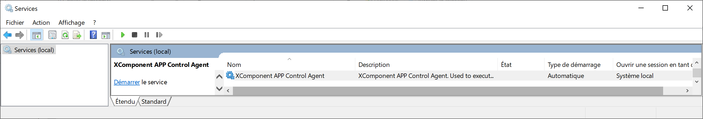

# AppControl Agents


## Latest Available versions

| Operating System | Version | Format| Latest version |
| -----------------|------|------|------------|
| Microsoft Windows 32 bits | All Versions  | zip | [Windows Agent32 Zip](https://github.com/xcomponent/appcontrol-documentation/releases/latest/download/xcAgent-binary-Win32.zip) |  
| Microsoft Windows 64 bits | All Versions  | zip | [Windows Agent64 Zip](https://github.com/xcomponent/appcontrol-documentation/releases/latest/download/xcAgent-binary-Win64.zip) |  
| Alpine| 3.18.3 |tar.gz| [Alpine tar.gz](https://github.com/xcomponent/appcontrol-documentation/releases/latest/download/alpine.tar.gz) |
| Alma Linux (EL)| 8.8 (Compatibility with RedHat 8)| tar.gz| [Alma8 tar.gz](https://github.com/xcomponent/appcontrol-documentation/releases/latest/download/almalinux8.tar.gz)|
| Alma Linux (EL)| 9.2 (Compatibility with RedHat 9)| tar.gz| [Alma9 tar.gz](https://github.com/xcomponent/appcontrol-documentation/releases/latest/download/almalinux9.tar.gz)|
| Rocky Linux (EL)| 8.8 (Compatibility with RedHat 8) | tar.gz| [Rocky8 Linux](https://github.com/xcomponent/appcontrol-documentation/releases/latest/download/rockylinux8.tar.gz)|
| Rocky Linux (EL)| 9.2 (Compatibility with RedHat 9) | tar.gz| [Rocky9 Linux](https://github.com/xcomponent/appcontrol-documentation/releases/latest/download/rockylinux9.tar.gz)|
| Debian| 11.7 | tar.gz| [Debian11 tar.gz](https://github.com/xcomponent/appcontrol-documentation/releases/latest/download/debian11.tar.gz)|
| Debian| 12.1 | tar.gz| [Debian12 tar.gz](https://github.com/xcomponent/appcontrol-documentation/releases/latest/download/debian.tar.gz)|
| Alpine| alpine:3.18.3| docker| docker pull xcomponent/appcontrol-agent:latest-alpine|
| Alma Linux (EL)| almalinux:8.8-minimal (Compatibility with RedHat 8)| docker| docker pull xcomponent/appcontrol-agent:latest-almalinux|
| Alma Linux (EL)| almalinux:9.2-minimal (Compatibility with RedHat 9)| docker| docker pull xcomponent/appcontrol-agent:latest-almalinux|
| Debian| debian:11.5-slim |docker| docker pull xcomponent/appcontrol-agent:latest-debian|
| Rocky Linux (EL)| rockylinux:8.8-minimal (Compatibility with RedHat 8)|docker| docker pull xcomponent/appcontrol-agent:latest-rockylinux|
| Rocky Linux (EL)| almalinux:9.2-minimal (Compatibility with RedHat 9)|docker| docker pull xcomponent/appcontrol-agent:latest-rockylinux|

All binaries versions are listed here: [All binaries versions](https://github.com/xcomponent/appcontrol-documentation/releases/)

All docker versions are listed here: [All docker versions](
https://hub.docker.com/r/xcomponent/appcontrol-agent/tags)

## Microsoft Windows Platform

**Note:**
```
We recommand to use cmd.exe as a shell to install the agent. We don't offer the support for installation through powershell.
```

To install XComponent AppControl Agent under Windows OS, unzip the following [file](https://github.com/xcomponent/appcontrol-documentation/releases/latest/download/xcAgent-binary-Win32.zip) into an installation directory.
The configuration file (** config.dat **) is located in the same directory.
Refer to the agent configuration section to customize the configuration.
You have 2 options:
  - Install an run the agent as a Microsoft Windows Service
  - Run the agent in interactive mode (in a cmd.exe)

### Option 1. Install and start the agent as a Microsoft Windows Service

- To register the program in the service registry of the Microsoft� Windows machine execute the following command in a prompt (cmd.exe) with administrative permissions:

```console
C:\appcontrol>xcAgent --install --servicename XComponentAppControlAgent
XComponent App Control Agent, version 9.9
Copyright © Invivoo Software 2022
XComponent AppControl service name: XComponentAppControlAgentXComponent AppControl service display name: XComponent AppControl AgentXComponentAppControlAgent is installed.
```

- We can either specify the display service name during registration: 
```console
C:\appcontrol>xcAgent.exe --install --servicename appcontrolagent --servicedisplayname "Agent AppControl"
XComponent App Control Agent, version 9.9
Copyright © Invivoo Software 2022
XComponent App Control service name: appcontrolagent
XComponent App Control service display name: Agent AppControl
appcontrolagent is installed.
```
- Uninstalling the agent can be done also with the following command line:
```console
C:\appcontrol>xcAgent.exe --uninstall --servicename appcontrolagent
XComponent App Control Agent, version 9.9
Copyright © Invivoo Software 2022
appcontrolagent has been uninstalled.
```

- Start the service **XComponent AppControl Agent**



### Option 2. Run the agent in interactive mode from a prompt (cmd.exe)

Run cmd.exe and the go the agent folder.

```console
C:\appcontrol>xcAgent.exe --console
XComponent AppControl Agent, version 7.0.0-R1
Copyright © Invivoo Software 2022

```

### Adding a Microsoft Windows firewall port rule (optional step)

If you need to communicate with the agent from another computer, you should need to create a firewall rule to open the agent's port. 

In the case the agent's port is 12567, the command above creates the correct rule on the firewall.

Run cmd.exe (with Administrative permissions) and then execute the following command.

```console
C:\>netsh advfirewall firewall add rule name="AppControl-AgentRule" dir=in action=allow protocol=TCP localport=12567	

```

You can check that the rule is correctly created with this command:

```console
C:\>netsh advfirewall firewall show rule name="AppControl-AgentRule"
```

Please refer to the following [link](#agent-port) to check if the agent port is reachable.

**Note:**
```
If you are using another firewall or and anti-virus, you should refer to the corresponding documentation.
```

## Enterprise Linux

At the moment EL versions of XComponent AppControl Agent are Rocky Linux and Alma Linux.

To install XComponent AppControl Agent under EL, untar the following [Alma tar.gz](https://github.com/xcomponent/appcontrol-documentation/releases/latest/download/almalinux.tar.gz) into an installation directory (Tarball file).
The configuration file (** config.dat **) is located in the same directory.
Refer to the agent configuration section to customize the configuration.

Replace **/home/xc/xcagent** by your own installation folder.

```console
/home/xc/xcagent $ export LD_LIBRARY_PATH=$LD_LIBRARY_PATH:/home/xc/xcagent/libs
/home/xc/xcagent $ ./xcAgent.bin --file /home/xc/xcagent/config.dat

XComponent AppControl Agent, version 7.0.0-R1
Copyright � Invivoo Software 2022

```

## Agentless Linux & Unix

From an XComponent AppControl Linux agent, you can enable AgentLess mode via SSH2.
This mode allows a Linux XComponent AppControl Agent to forward actions provided by the AppControl server under a non permanent Ssh channel to the IP address and account configured in the agent configuration file.
Refer to the agent configuration section to customize the configuration.

## Docker Installation

The docker image of the agent is available [here](https://hub.docker.com/r/xcomponent/appcontrol-agent) on docker hub.

You can pull the docker image using the following command line:

```console
root $ docker pull xcomponent/appcontrol-agent:latest
```

Environment variables exposed by the docker image are the following:

| Variable               | Description                                                                                                        |
| ---------------------- | ------------------------------------------------------------------------------------------------------------------ |
| CONFIG_FILE_PATH       | Path to the **config.dat**                                                                                         |
| TRUSTED_SERVERS        | List of IP addresses, or Dns names of XComponent AppControl servers authorized to contact the agent (Can be empty) |
| LOG_LEVEL              | Log levels ('NONE', 'ERROR', 'INFO', 'TRACE')                                                                      |
| PORT                   | Default value: 12567. Port used as the agent's TCP listening port. Numerical format.                               |
| NB_DAYS_TO_DELETE_LOGS | Default value: 0. Retention period for trace files archived under logdirectory /logs-backup/ (In number of days)   |
| LOG_STANDARD_OUTPUT    | Default value: true. Boolean value (true or false). If true redirect all the logs to std output                    |

Some Technicals Points:

1. If your agent needs to access to local resources (eg: scripts), you have 2 ways to achieve this:
   - Inherits from this docker image and create your own image
   - Or you can map a directory to the docker image

Running the docker image:

```console
root $ docker run -p 12567:12567 xcomponent/appcontrol-agent:latest
```

## Agent Configuration

The default configuration file is name config.dat. It's located near the XComponent AppControl Agent configuration file.

```xml
<config>
  <item key="networkAddress"     value="127.0.0.1" />
  <item key="port"               value="12567" />
  <item key="checktimeout"       value="20" />
  <item key="logdirectory"       value="log" />
  <item key="tempdirectory"      value="tmp" />
  <item key="maxlogsizeinmo"     value="5" />
  <item key="nbdaystodeletelogs" value="10" />
  <item key="executionthreshold" value="30" />
  <!--Log level : NONE, INFO, TRACE, ERROR -->
  <item key="loglevel"           value="INFO" />
  <item key="trustedservers"     value="127.0.0.1" />
  <item key="sshhost"            value="127.0.0.1" />
  <item key="sshkeydirectory"    value="sshkeys" />
</config>
```

| Key                | Description                                                                                                                                                                                                                                                                                                    |
| ------------------ | -------------------------------------------------------------------------------------------------------------------------------------------------------------------------------------------------------------------------------------------------------------------------------------------------------------- |
| networkAddress     | IP address used to open the agent's TCP listening port. A.B.C.D format (0.0.0.0 for all interfaces of the machine)                                                                                                                                                                                             |
| port               | Port used as the agent's TCP listening port. Numerical format.                                                                                                                                                                                                                                                 |
| checktimeout       | Maximum time allowed for a check command. Once this period has passed, the check order is considered completed. (In seconds)                                                                                                                                                                                   |
| logdirectory       | Agent's trace file recording directory.                                                                                                                                                                                                                                                                        |
| tempdirectory      | Agent's working directory                                                                                                                                                                                                                                                                                      |
| maxlogsizeinmo     | Maximum size before rotation of the trace file (In Megabytes)                                                                                                                                                                                                                                                  |
| nbdaystodeletelogs | Retention period for trace files archived under logdirectory /logs-backup/ (In number of days)                                                                                                                                                                                                                 |
| loglevel           | Log levels ('NONE', 'ERROR', 'INFO', 'TRACE')                                                                                                                                                                                                                                                                  |
| executionthreshold | Maximum number of parallel executions for (Start/Stop/Custom actions). This parameter is not applied on check actions.                                                                                                                                                                                         |
| trustedservers     | List of IP addresses, or Dns names of XComponent AppControl servers authorized to contact the agent (Can be empty)                                                                                                                                                                                             |
| ignoretrustedservers     | Disable trusted server option                                                                                                                                                                                   |
| sshhost            | This parameter allows the agent to perform an SSH session with the account specified in the configuration of the application. The file containing the private key to use is located in the 'sshkeydirectory' directory and bears the name of the targeted user.This property works exclusively on Linux agent. |
| sshkeydirectory    | Directory for storing Ssh private key files. The name of the expected files must be named with the name of the user targeted by the application configuration. The public key must be present in the ~/ssh/authorized_keys file of the remote account                                                          |

## Environment variables configuration

Config.dat configuration supports environment variables as a value.

 **Under Microsoft Windows:**

In config.dat you can use environment variables with the following pattern: %VARIABLE%.

```xml
<config>
...
  <item key="tempdirectory" value="%TEMP%" />
...
</config>
```

**Under Linux/Unix:**

In config.dat you can use environment variables with the following pattern: $VARIABLE.

```xml
<config>
...
   <item key="tempdirectory" value=”$TEMP" />
...
</config>
```

**Note:**
```
Each item key of the config.dat file can be overriden  by an environment variable named XC_MYITEMKEYINUPPERCASE. The priority is the following:
1. If an XC_... variable exists the agent will use it
2. The values in the config.dat are used only if the XC_... variables don't exist.

Example: 
if an env variable named XC_TEMPDIRECTORY exists, this value will be used instead of the variable 'tempdirectory' defined in the config.dat.

```

## Checking that agent's port is opened
<a id="agent-port"></a>
In some situations, we need to check that the agent's port is correctly bind and accessible from another computer.

1. Checking that the agent binds on its port (locally):

```console
curl localhost:12567
```
If the agent is running, the expected message is:
```console
curl: (52) Empty reply from server
```
If the agent is not running, the  message is:
```console
curl: (7) Failed to connect to localhost port 12567 after 2267 ms: Couldn't connect to server
```

2. Checking that the agent binds on its port (from a remote machine):

```console
curl mymachine:12567
```
If the agent is running, the expected message is:
```console
curl: (52) Empty reply from server
```
If the agent is not running or unreachable (for example behind a firewall), the  message is:
```console
curl: (7) Failed to connect to mymachine port 12567 after 2267 ms: Couldn't connect to server
```

**Note:**
```
You can use the AppControl Gateway to both check agent connectivity and also to execute commands on the agent host.
```
Please refer to the following [link](x4bcli.md#agent-communication)
